# 2.1 二分类(Binary Classification)

我们知道逻辑回归是一个用于二分类(**binary classification**)的算法。。
二分类就是输出y只有{0,1}两个离散值（也有{-1,1}的情况）。 我们以一个图像识别问题为例，判断图片中是否有猫存在，0代表noncat，1代表cat。其输入是由特征向量𝑥表示的图像，并预测相应的标签𝑦是1还是0。
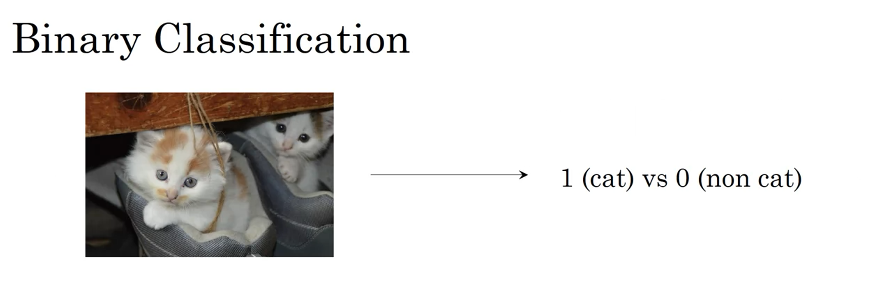
在计算机中为了保存一张图片，需要保存三个矩阵，它们分别对应图片中的红、绿、蓝三种颜色通道，三个矩阵与图像大小相同，如果图片大小为64x64像素，那么你就有三个规模为64x64的矩阵，分别对应图片中红、绿、蓝三种像素的强度值。
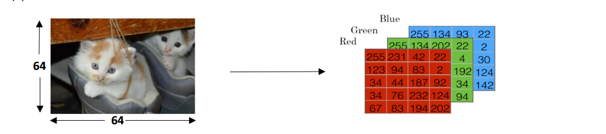

单元格中的值表示将用于创建 n 维特征向量的像素强度。在模式识别和机器学习中，一个特征向量代表一个图像。为了创建特征向量 𝑥，每种颜色的像素强度值将被“展开”或“重塑”。输入特征向量𝑥的维度为𝑛= 64\*64\*3 = 12288。

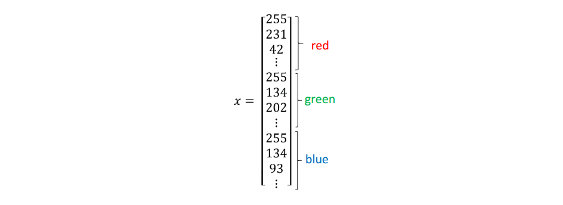

所以在二分类问题中，我们的目标是学习一个分类器：输入一幅以特征向量𝑥表示的图像，并预测相应的输出标签𝑦是1还是0。

**Notation**
- 样本： $(x,y)$, 训练样本包含$m$个； 
- 其中$x\in R^{n_x}$,表示样本$x$ 包含$n_x$个特征；
- $y\in0,1$,目标值属于0、1分类；
- m个训练数据:$\left\{(x^{(1)},y^{(1)}),(x^{(2)},y^{(2)}),\cdots,(x^{(m)},y^{(m)})\right\}$

输入神经网络时样本数据的形状为：
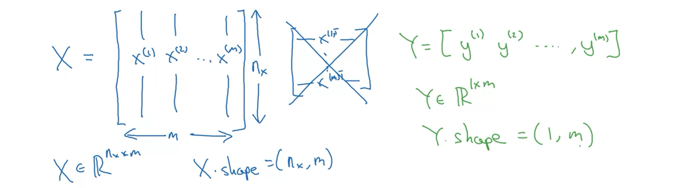

# 2.2 逻辑回归(Logistic Regression)

接下来我们就来介绍如何使用逻辑回归来解决二分类问题。

逻辑回归中，给定输入 $x$, 预测值 $\hat{y}=P(y=1|x),\mathrm{where}0\leq\hat{y}\leq1$ 表示为1的概率，取值范围在\[0,1\]之间。

这是其与二分类模型不同的地方。逻辑回归的预测值为一个连续的概率。

Logistic回归中使用的参数是：
- 输入特征向量：$x\in\mathbb{R}^{n_x}$ ，其中 $𝑛_𝑥$ 是特征数量 
- 训练标签：𝑦 ε 0,1 
- 权重：$w\in\mathbb{R}^{n_x}$ ，其中$𝑛_𝑥$ 是特征数量 
- 阈值：𝑏 ε ℝ 
- 输出：$\hat{y}=\sigma(w^{T}x+b)$
- Sigmoid 函数：$s=\sigma(w^{T}x+b)=\sigma(z){=}\frac{1}{1+e^{-z}}$

$w^{T}x+b$是一个线性函数 (𝑎𝑥 + 𝑏)，其输出为一个连续的概率。但由于我们正在寻找 \[0,1\] 之间的概率约束，因此使用 sigmoid 函数将输出边界限制在在\[0,1\] 之间，如下图所示。
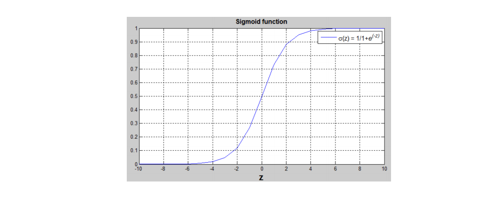

sigmoid函数的公式为：$\sigma(z){=}\frac{1}{1+e^{-z}}$

其中，z是一个实数。

需要注意以下几点：

1. 当z非常大时，sigmoid函数接近于1。这是因为指数$e^{-x}$会变得非常小，接近于0，所以1除以1加上一个接近于0的项，结果就会接近于1。

2. 相反地，当x非常小或为一个绝对值很大的负数时，sigmoid函数接近于0。可以将其看作是1除以1加上一个非常非常大的数，结果就会接近于0。

3. 实际上，当x变成一个绝对值很大的负数时，sigmoid函数会非常接近于0。

因此，在实现逻辑回归时，我们的目标是通过调整机器学习参数w和b，使得sigmoid函数能够很好地估计给定情况的概率。

现在你已经知道逻辑回归模型是什么样子了，下一步要做的是使用代价函数训练参数w和参数b。
# 2.3 逻辑回归的代价函数（Logistic Regression Cost Function）

为了训练参数𝑤和𝑏，我们需要定义一个成本函数。

## 损失函数
损失函数测量预测 $(\hat{y}^{(i)})$ 和期望输出 $({y}^{(i)})$之间的差异。
换句话说，损失函数计算单个训练示例的误差。

对于逻辑回归，我们一般不使用平方误差$L(\hat{y},y)=\frac12(\hat{y}-y)^2$来作为Loss function。因为上面的平方误差损失函数一般是非凸函数（non-convex），其在使用梯度下降算法的时候，容易得到局部最优解，而不是全局最优解，因此要选择凸函数，所以我们在逻辑回归模型中定义另外一个损失函数。
  $$L\left(\hat{y},y\right)=-y\log(\hat{y})-(1-y)\log(1-\hat{y})$$

当$y=1$时，$L(\hat{y},y)=-\log\hat{y}$。如果$\hat{y}$越接近1，$L(\hat{y},y)\approx0$,表示预测效果越好；如果$\hat{y}$越接近0， $L(\hat{y},y)\approx+\infty$,表示预测效果越差；

当$y=0$时，$L(\hat{y},y)=-\log(1-\hat{y})$。如果$\hat{y}$越接近0，$L(\hat{y},y)\approx0$,表示预测效果越好；如果$\hat{y}$越接近1，$L(\hat{y},y)\approx+\infty$,表示预测效果越差；

我们的目标是最小化样本点的损失Loss Function, 损失函数是针对单个样本点的。


## 成本函数
Loss function是针对单个样本的，成本函数是整个训练集的损失函数的平均值。
$$J(w,b)=\frac{1}{m}\sum_{i=1}^{m}L\big(\hat{y}^{(i)},y^{(i)}\big)=-\frac{1}{m}\sum_{i=1}^{m}\big[(y^{(i)}\log\big(\hat{y}^{(i)}\big)+\big(1-y^{(i)}\big)\log(1-\hat{y}^{(i)})\big]$$
# 2.4 梯度下降（Gradient Descent）

我们已经知道Cost function的表达式了，那么如何找到最小化成本的函数J(w,b)的w和b呢，接下来将使用梯度下降（Gradient Descent）算法来进行优化。

由于J(w,b)是convex function，梯度下降算法是先随机选择一组参数w和b值，然后每次迭代的过程中分别沿着w和b的梯度（偏导数）的反方向前进一小步，不断修正w和b。

每次迭代更新w和b后，都能让J(w,b)更接近全局最小值。梯度下降的过程如下图所示。

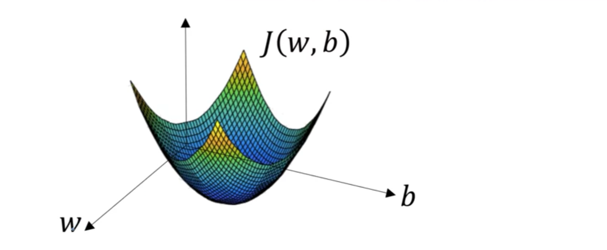


梯度下降算法每次迭代更新，w和b的修正表达式为：
$$
w:=w-\alpha\frac{\partial J(w,b)}{\partial w}
$$
$$
b:=b-\alpha\frac{\partial J(w,b)}{\partial b}
$$
上式中，$\alpha$是学习因子( learning rate),表示梯度下降的步进长度。$\alpha$越大，w和b每次更新的“步伐”更大一些；$\alpha$越小，w和b每次更新的$^\mathrm{\iota}$步伐”更小一些。

在程序代码中，我们通常使用dw来表示$\frac{\partial J(w,b)}{\partial w}$ ,用db来表示$\frac{\partial J(w,b)}{\partial b}$。微积分里，$\frac{df}{dx}$表 示对单一变量求导数，$\frac{\partial f}{\partial x}$表示对多个变量中某个变量求偏导数。

梯度下降算法能够保证每次迭代w和b都能向着J(w,b)全局最小化的方向进行。

# 2.5 计算图（Computation Graph）

整个神经网络的训练过程实际上包含了两个过程：正向传播（Forward Propagation）和反向传播（Back Propagation）。

正向传播是从输入到输出，由神经网络计算得到预测输出的过程；反向传播是从输出到输入，利用输出计算出对应的梯度或导数，对参数w和b计算梯度的过程。

下面，我们用计算图（Computation graph）的形式来理解这两个过程。


举个简单的例子，假如Cost function为J(a,b,c)=3(a+bc)，包含a，b，c三个变量。
我们用u表示bc，v表示a+u，则J=3v。
它的计算图可以写成如下图所示：
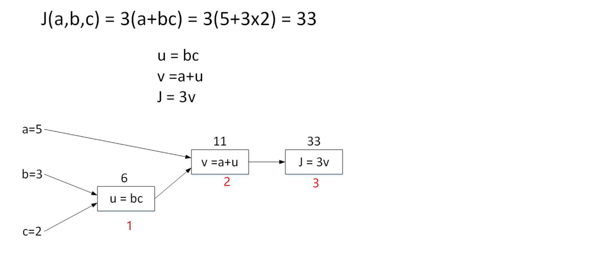

首先计算u=bc，接着计算v=a+u，最后计算J=3v

计算图中，这种从左到右，从输入到输出的过程就对应着神经网络或者逻辑回归中输入与权重经过运算计算得到Cost function的正向过程。


# 2.6 计算图导数（Derivatives with a Computation Graph）

上一部分介绍的是计算图的正向传播（Forward Propagation），下面我们来介绍其反向传播（Back Propagation），即计算输出对输入的偏导数。

还是上个计算图的例子，输入参数有3个，分别是a，b，c。
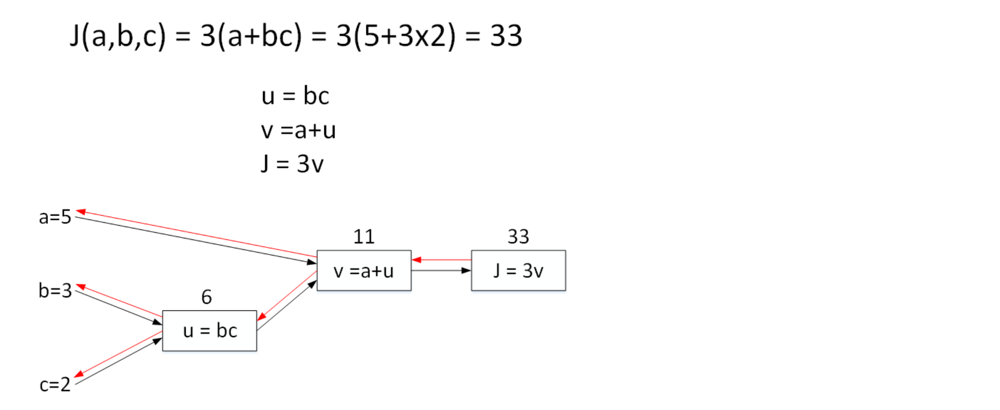
首先计算J对参数a的偏导数。从计算图上来看，从右到左，J是v的函数，v是a的函数。则利用求导技巧，可以得到：
$\frac{\partial J}{\partial a}=\frac{\partial J}{\partial v}\cdot\frac{\partial v}{\partial a}=3\cdot1=3$

然后计算J对参数b的偏导数。从计算图上来看，从右到左，J是v的函数，v是u的函数，u是b的函数。可以推导：
$\frac{\partial J}{\partial b}=\frac{\partial J}{\partial v}\cdot\frac{\partial v}{\partial u}\cdot\frac{\partial u}{\partial b}=3\cdot1\cdot c=3\cdot1\cdot2=6$

最后计算J对参数c的偏导数。仍从计算图上来看，从右到左，J是v的函数，v是u的函数，u是c的函数。可以推导：
$\frac{\partial J}{\partial c}=\frac{\partial J}{\partial v}\cdot\frac{\partial v}{\partial u}\cdot\frac{\partial u}{\partial c}=3\cdot1\cdot b=3\cdot1\cdot3=9$

# 2.7 逻辑回归的梯度下降（Logistic Regression Gradient Descent）

我们对逻辑回归进行梯度计算。

对单个样本而言，逻辑回归损失函数如下：

$$\begin{gathered}
z=w^Tx+b \\
\hat{y}=a=\sigma(z) \\
L(a,y)=-(ylog(a)+(1-y)log(1-a)) 
\end{gathered}$$

对于**正向传播**：
假设输入样本x有两个特征($x_1,x_2$)，相应的权重w维度也是2，即($w_1,w_2$)。则$z=w_1x_1+w_2x_2+b$，正向传播计算图如下：

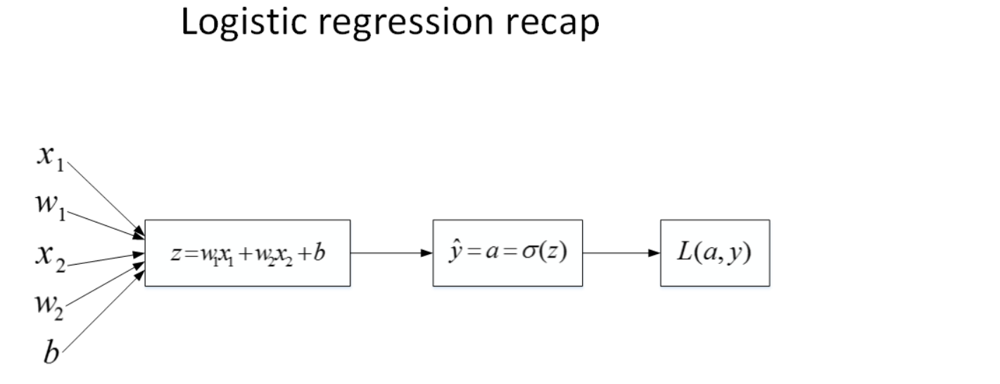

对于**反向传播**：

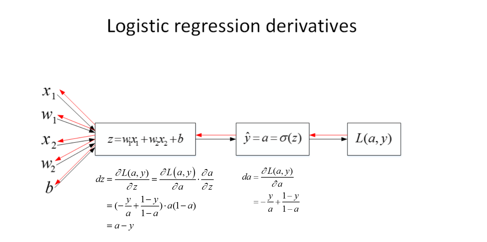

知道了$d_z$之后，就可以直接对$w_1$，$w_2$和b进行求导了。
$$\begin{aligned}dw_1&=\frac{\partial L}{\partial w_1}=\frac{\partial L}{\partial z}\cdot\frac{\partial z}{\partial w_1}=x_1\cdot dz=x_1(a-y)\\dw_2&=\frac{\partial L}{\partial w_2}=\frac{\partial L}{\partial z}\cdot\frac{\partial z}{\partial w_2}=x_2\cdot dz=x_2(a-y)\\db&=\frac{\partial L}{\partial b}=\frac{\partial L}{\partial z}\cdot\frac{\partial z}{\partial b}=1\cdot dz=a-y\end{aligned}$$

则梯度下降算法可表示为：

$$
\begin{gathered}w_1:=w_1-\alpha\:dw_1\\w_2:=w_2-\alpha\:dw_2\\b:=b-\alpha\:db\end{gathered}
$$

**总结：**
首先知道参数w和b，利用正向传播计算出损失函数的值，接着根据损失函数的值利用反向传播计算出w和b的导数，最后利用计算出的导数更新w和b的值
$$\begin{gathered}
w=w-\alpha\frac{\partial J(w,b)}{\partial w} \\
b=b-\alpha\frac{\partial J(w,b)}{\partial b} 
\end{gathered}$$
依次循环，直到损失函数最小。
# 2.8 m个样本的梯度下降的例(Gradient Descent on m Examples)

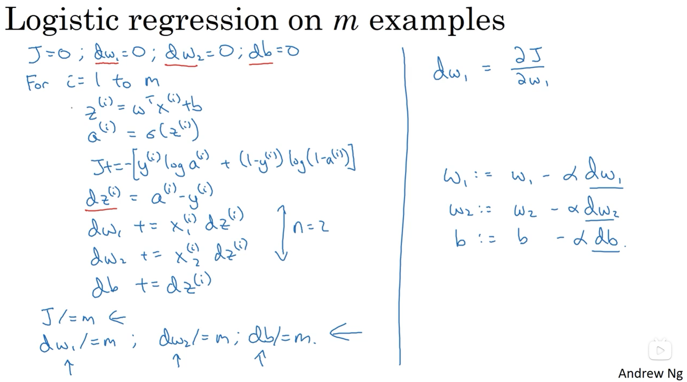

Cost function关于w和b的偏导数可以写成和平均的形式：
$$\begin{gathered}\begin{aligned}dw_1&=\frac1m\sum_{i=1}^mx_1^{(i)}(a^{(i)}-y^{(i)})\\\\dw_2&=\frac1m\sum_{i=1}^mx_2^{(i)}(a^{(i)}-y^{(i)})\\\\db&=\frac1m\sum_{i=1}^m(a^{(i)}-y^{(i)})\end{aligned}\end{gathered}$$

$\mathrm{d}\omega_{1}$ 、$\mathrm{d}\omega_{2}$ 用于累加，单个样本中的偏导数都累加在此，最后求平均，所以初始化为0。 

在上述的梯度下降算法中，我们是利用for循环对每个样本进行$dw_1$，$dw_2$和$d_b$的累加计算最后再求平均数的。

在深度学习中，样本数量m通常很大，使用for循环会让神经网络程序运行得很慢。

所以，我们应该尽量避免使用for循环操作，而使用矩阵运算，能够大大提高程序运行速度。

# 2.9 向量化(Vectorization)
深度学习算法中，数据量很大，在程序中应该尽量减少使用循环语句，而可以使用向量运算来提高程序运行速度。

向量化（Vectorization）就是利用矩阵运算的思想，大大提高运算速度。

# 2.10 向量化逻辑回归(Vectorizing Logistic Regression)
我们前面介绍过，整个训练样本构成的输入矩阵X的维度是（$n_{x}$，m），权重矩阵w的维度是（$n_{x}$，1），b是一个常数值，而整个训练样本构成的输出矩阵Y的维度为（1，m）。

利用向量化的思想，所有m个样本的线性输出Z可以用矩阵表示：
$Z=w^TX+b$

在python的numpy库中可以如下表示，其中，w.T表示w的转置。

$$
\begin{array}{rcl}Z&=&\text{np.dot(w. T, X)}&+&\text{b}\\\text{A}&=&\text{sigmoid(Z)}&&\end{array}
$$
这样，我们就能够使用向量化矩阵运算代替for循环，对所有m个样本同时运算，大大提高了运算速度。

# 2.11 向量化逻辑回归的梯度计算（Vectorizing Logistic Regression's Gradient）

逻辑回归中的梯度下降算法如何转化为向量化的矩阵形式。

对于m个样本，$d_Z$的维度是 (1, m), 可表示为：

$$
\begin{aligned}dZ=A-Y\end{aligned}
$$

$d_b$可表示为：

$$
db=\frac1m\sum_{i=1}^mdz^{(i)}
$$

$d_w$可表示为：
$$
dw=\frac1mX\cdot dZ^T
$$
于单次迭代，梯度下降算法流程如下所示：
```python
Z = np. dot(w.T,X) + b
A = sigmoid (2)
dZ =A - Y
dw = 1/m*np.dot(X,dZ.T) 
db = 1/m米np. sum(d2)

w = w - alpha*dw
b = b - alpha*db
```
# 2.12 关于 Python与numpy向量的使用技巧（A note on python or numpy vectors）

python中，如果我们用下列语句来定义一个向量：
`a = np.random.randn(5)`

这条语句生成的a的维度是(5，)。它既不是行向量也不是列向量，我们把a叫做rankv1 array。

这种定义会带来一些问题。例如我们对a进行转置，还是会得到a本身。

所以，如果我们要定义(5,1)的列向量或者(1,5)的行向量，最好使用下来标准语句，避免使用rank1 array。
```
a = np.random.randn(5,1)
b = np.random.randn(1,5)
```

除此之外，我们还可以使用assert语句对向量或数组的维度进行判断，例如：
`assert(a.shape ==(5,1))`

assert会对内嵌语句进行判断，即判断a的维度是不是(5,1)的。如果不是，则程序在此处停止。

另外，还可以使用reshape函数对数组设定所需的维度：
`a.reshape((5,1))`
