# 1 神经网络概述

神经网络的结构与逻辑回归类似，只是神经网络的层数比逻辑回归多一层，多出来的中间那层称为隐藏层。
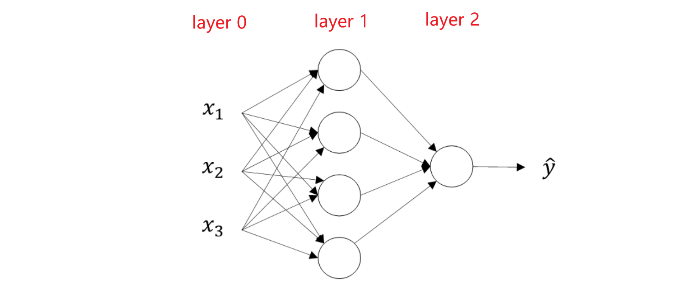

最右边这一层叫做**输出层**（output layer），因为最后一层输出的是整个神经网络的预测值。最左边一层叫**输入层**（input layer）。在输入层和输出层中间的所有层都叫**隐藏层**，在神经网络中输入层和输出层都有明确的数值，而中间的层并没有告诉确切的数值，是未知的，所以叫隐藏层。

该神经网络为两层神经网络，一般我们不把输入层纳入神经网络的层数中，除输入层以外的所有层数总数为网络的总层数。

# 2 浅层神经网络
如下图所示，单隐藏层神经网络就是典型的浅层（shallow）神经网络，因为网络层数交少（浅）。

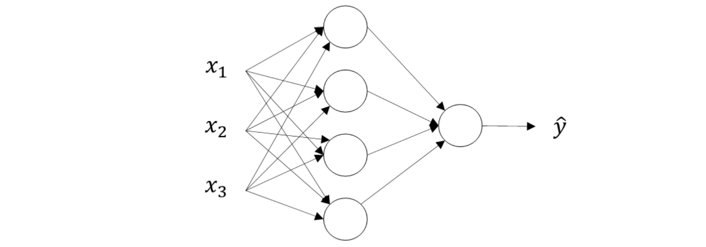
结构上，从左到右，可以分成三层：输入层（Input layer），隐藏层（Hidden layer）和输出层（Output layer）。

# 3 计算神经网络输出

接下来我们开始详细推导神经网络的计算过程。

两层神经网络可以看成是计算完第一层的逻辑回归后再重复计算一次逻辑回归。如下图所示，逻辑回归的正向计算可以分解成计算z和a的两部分：

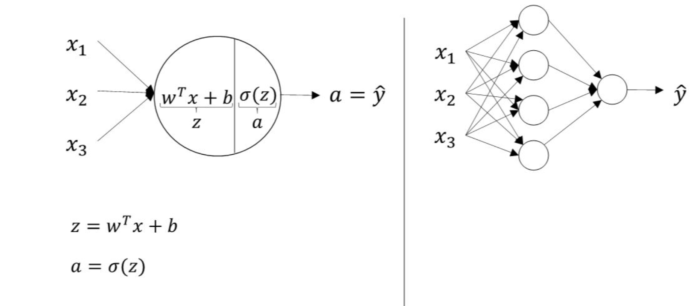

对于两层神经网络，从输入层到隐藏层对应一次逻辑回归运算；从隐藏层到输出层对应一次逻辑回归运算。每层计算时，要注意对应的上标和下标，一般我们记上标方括号表示layer，下标表示第几个神经元。例如$a_i^{[l]}$表示第l层的第i个神经 元。注意，i从1开始，l从0开始。

下面，我们将从输入层到输出层的计算公式列出来：
$$\begin{gathered}
z_{1}^{[1]} =w_1^{[1]T}x+b_1^{[1]},\mathrm{~}a_1^{[1]}=\sigma(z_1^{[1]}) \\
z_2^{[1]} =w_2^{[1]T}x+b_2^{[1]},a_2^{[1]}=\sigma(z_2^{[1]}) \\
z_3^{[1]} =w_3^{[1]T}x+b_3^{[1]},~a_3^{[1]}=\sigma(z_3^{[1]}) \\
z_4^{[1]} =w_4^{[1]T}x+b_4^{[1]},a_4^{[1]}=\sigma(z_4^{[1]}) 
\end{gathered}$$

然后，从隐藏层到输出层的计算公式为：
$$
z_1^{[2]}=w_1^{[2]T}a^{[1]}+b_1^{[2]},\mathrm{~}a_1^{[2]}=\sigma(z_1^{[2]})
$$
其中$a^{[1]}$为：
$$a^{[1]}=\begin{bmatrix}a_1^{[1]}\\a_2^{[1]}\\a_3^{[1]}\\a_4^{[1]}\end{bmatrix}$$
上述每个节点的计算都对应着一次逻辑运算的过程，分别由计算z和a两部分组成。

同样的，为了提高程序运算速度，我们引入向量化和矩阵运算的思想，将上述表达式转换成矩阵运算的形式：
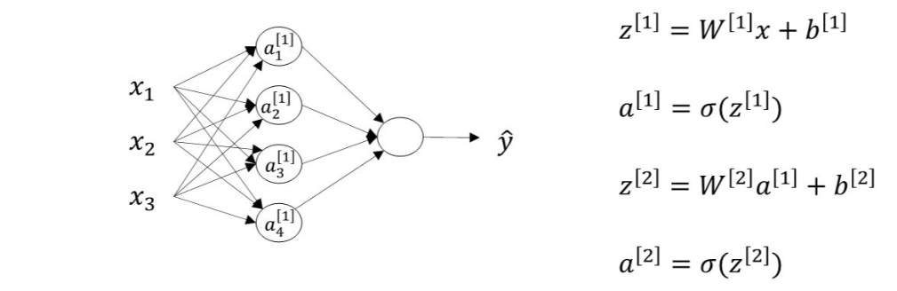
# 4 矩阵运算

对于m个训练样本的运算，不使用for循环，利用矩阵运算的思想，输入矩阵X的维度为（$n_x$,m）。这样，我们可以将for循环写成矩阵运算的形式：
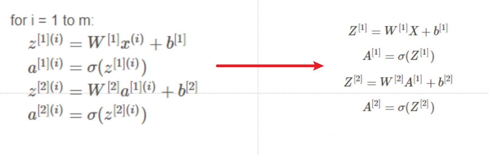
其中，$Z^{[1]}$的维度是(4,m),4是隐藏层神经元的个数；$A^{[1]}$的维度与$Z^{[1]}$相同；$Z^{[2]}$和$A^{[2]}$的维度均为(1,m)。对上面这四个矩阵来说，均可以这样来理解：行表示神经元个数，列表示样本书目m

# 5 非线性激活函数

原先的四种激活函数都是非线性（non-linear）的。那是否可以使用线性激活函数呢？答案是不行！

如果使用线性激活函数，使用神经网络与直接使用线性模型的效果并没有什么两样。即便是包含多层隐藏层的神经网络，如果使用线性函数作为激活函数最终的输出仍然是输入X的线性模型。这样的话神经网络就没有任何作用了。因此，隐藏层的激活函数必须要是非线性的。

另外，如果所有的隐藏层全部使用线性激活函数，只有输出层使用非线性激活函数，那么整个神经网络的结构就类似于一个简单的逻辑回归模型，而失去了神经网络模型本身的优势和价值。

但是，如果是预测问题而不是分类问题，并且输出y是连续的情况下，输出层的激活函数可以使用线性函数。如果输出y恒为正值，则也可以使用ReLU激活函数，具体情况，具体分析。

# 6激活函数的导数
1. **sigmoid activation function**
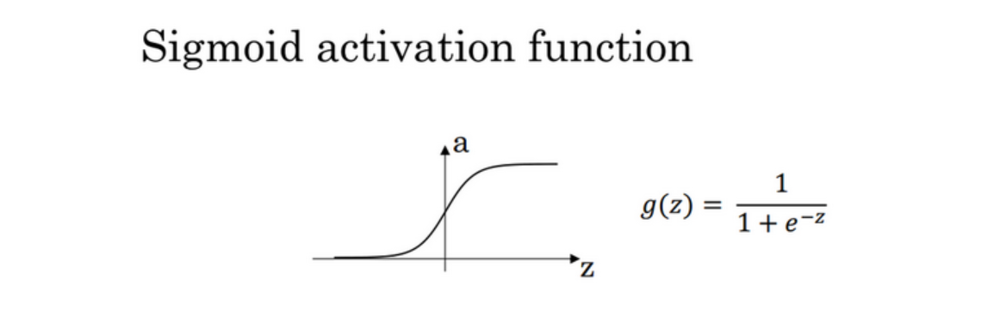

$\frac{d}{dz}g(z)=\frac{1}{1+e^{-z}}(1-\frac{1}{1+e^{-z}})=g(z)(1-g(z))$
当$z=10$或$z=-10$ ;${\frac{d}{dz}}g(z)\approx0$
当$z=0$ $\frac{d}{dz}g(z)=g(z)(1-g(z))=1/4$

在神经网络中$\begin{aligned}a=g(z);g(z)^{'}=\frac{d}{dz}g(z)=a(1-a)\end{aligned}$

2. **Tanh activation function**
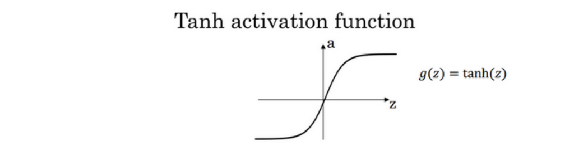

 $g(z)=tanh(z)=\frac{e^{z}-e^{-z}}{e^{z}+e^{-z}}$
$\frac d{dz}g(z)=1-(tanh(z))^2$

当$z=10$或$z=-10\:\frac{d}{dz}g(z)\approx0$
当$z=0,\:\frac{d}{dz}g(z)\text{=1-}(0)\text{=1}$

3. **Rectified Linear Unit (ReLU)**
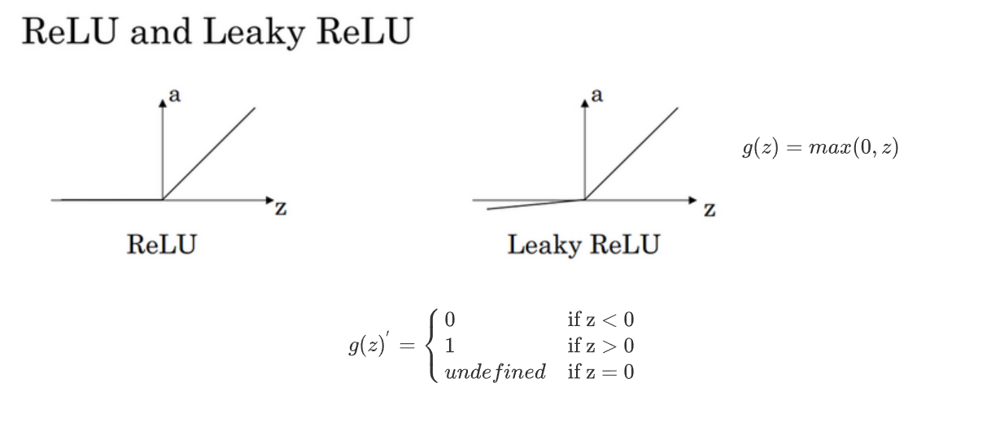
$g(z)=max(0,z)$
$$\left.g(z)^{'}=\left\{\begin{array}{ll}0&\text{if z<0}\\1&\text{if z>0}\\undefined&\text{if z=0}\end{array}\right.\right.$$
注：通常在$z= 0$的时候给定其导数1,0；当然$z=0$的情况很少很少

4. **Leaky linear unit (Leaky ReLU)**
$g(z)=\max(0.01z,z)$
$$\left.g(z)^{'}=\left\{\begin{array}{ll}0.01&\text{if z<0}\\1&\text{if z>0}\\undefined&\text{if z=0}\end{array}\right.\right.$$

# 7 反向传播

浅层神经网络：
- 参数： W$^{[1]},\mathrm{b}^{[1]},\mathrm{W}^{[2]},\mathrm{b}^{[2]};$ 
- 输入层特征向量个数： $\mathrm{n_x= n^{[ 0] }; }$
- 隐藏层神经元个数： n$^{[1]}$,
- 输出层神经元个数： n$^{[2]}=1;$
- W$^{[1]}$的维度为(n$^{[1]},\mathrm{n}^{[0]})$, b$^{[1]}$的维度为(n$^{[1]},1);$ 
- W$^{[2]}$的维度为(n$^{[2]},\mathrm{n}^{[1]})$, b$^{[2]}$的维度为(n$^{[2]},1);$

我们仍然使用计算图的方式来推导神经网络反向传播过程。
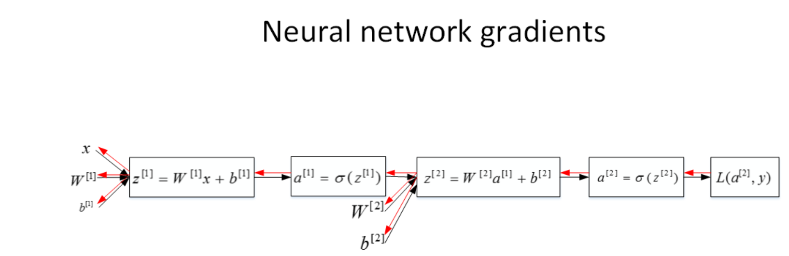
由于多了一个隐藏层，神经网络的计算图要比逻辑回归的复杂一些。对于单个训练样本，正向过程很容易，反向过程可以根据梯度计算方法逐一推导。
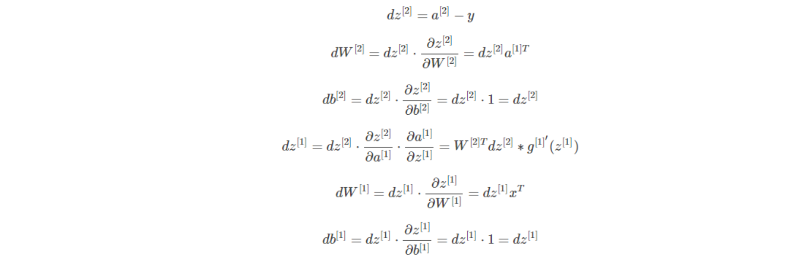

总结一下，浅层神经网络（包含一个隐藏层），m个训练样本的正向传播过程和反向传播过程分别包含了6个表达式，下图为神经网络反向传播公式（左）和其代码向量化（右）：
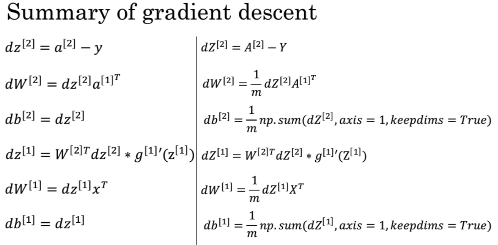

# 8 随即初始化

当你训练神经网络时，如果你把权重w都初始化为0，那么梯度下降将不会起作用。


举个简单的例子，一个浅层神经网络包含两个输
入，隐藏层包含两个神经元。如果权重$W^{[1]}$和 入
$W^{[2]}$都初始化为零,即
$$\begin{aligned}W^{[1]}&=\begin{bmatrix}0&0\\0&0\end{bmatrix}\\W^{[2]}&=\begin{bmatrix}0&0\end{bmatrix}\end{aligned}$$

这样使得隐藏层第一个神经元的输出等于第二个神经元的输出，即$a_1^{[1]}=a_2^{[1]}$。经过推导得到$dz_1^{[1]}=dz_2^{[1]}$,以及$dW_1^{[1]}=dW_2^{[1]}$。因此，这样的结果是隐藏层两个神经元对应的权重行向量$W_1^{[1]}$和$W_2^{[1]}$每次迭代更新都会得到完全相同的结果，$W_1^{[1]}$始终等于$W_2^{[1]}$,完全对称。这样隐藏层设置多个神经元就没有任何意义了。但是，参数b可以全部初始化为零，并不会影响神经网络训练效果

在初始化的时候，w参数要进行随机初始化，b则不存在对称性的问题它可以设置为0。
```python
W = np.random.rand((2,2))* 0.01
b = np.zero((2,1))

```

这里我们将W的值乘以0.01是为了尽可能使得权重W初始化为较小的值，这是因为如果使用sigmoid函数或者tanh函数作为激活函数时，W比较小，则$Z = W X + b$所得的值也比较小，处在0的附近，0点区域的附近梯度较大，能够大大提高算法的更新速度。而如果W设置的太大的话，得到的梯度较小，训练过程因此会变得很慢。

ReLU和Leaky ReLU作为激活函数时，不存在这种问题，因为在大于0的时候，梯度均为1。