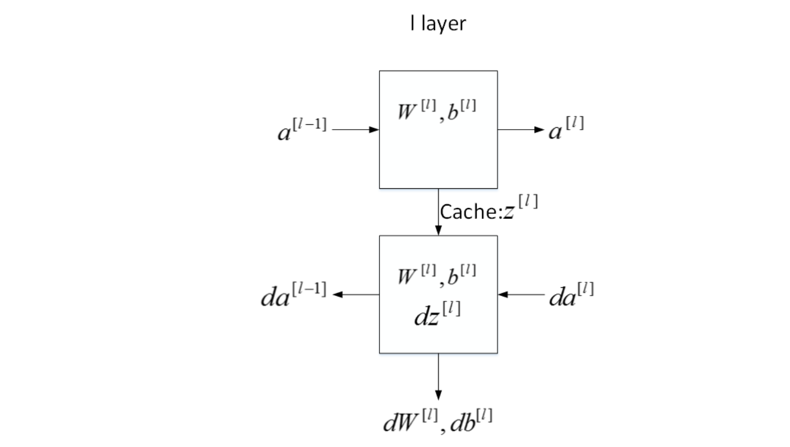
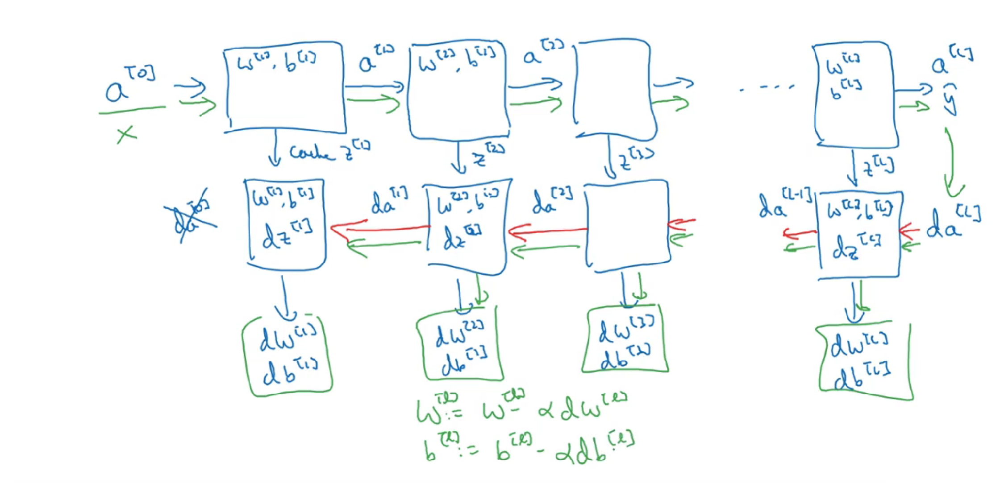
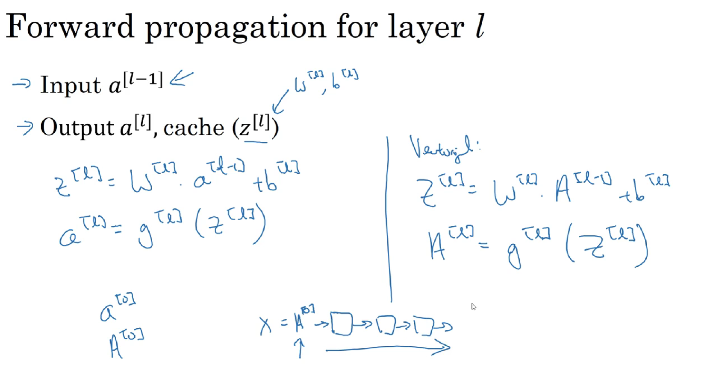
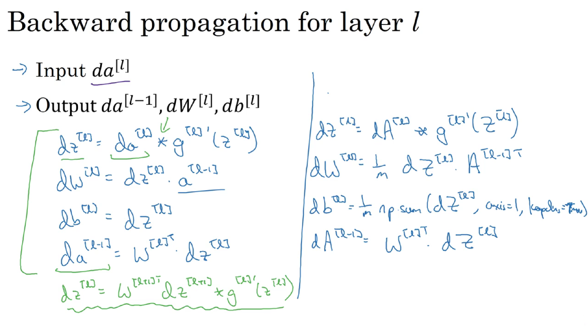
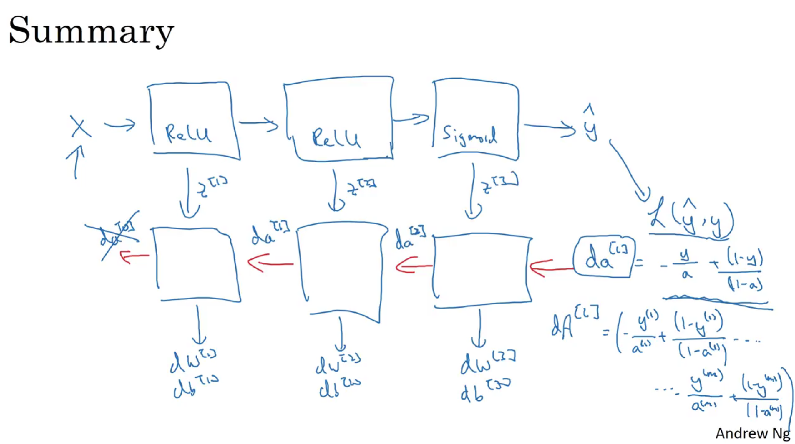

# 1 深层神经网络

深层神经网络其实就是包含更多的隐藏层神经网络。

# 2 深层神经网络正向传播

接下来，我们来推导一下深层神经网络的正向传播过程。

以4层神经网络为例，对于单个样本。

第1层，l=1：
$$\begin{gathered}z^{[1]}=W^{[1]}x+b^{[1]}=W^{[1]}a^{[0]}+b^{[1]}\\a^{[1]}=g^{[1]}(z^{[1]})\end{gathered}$$

第2层，l=2：
$$\begin{gathered}z^{[2]}=W^{[2]}a^{[1]}+b^{[2]}\\a^{[2]}=g^{[2]}(z^{[2]})\end{gathered}$$

第3层，l=3：
$$\begin{gathered}z^{[3]}=W^{[3]}a^{[2]}+b^{[3]}\\a^{[3]}=g^{[3]}(z^{[3]})\end{gathered}$$

第4层，l=4：
$$\begin{gathered}z^{[4]}=W^{[4]}a^{[3]}+b^{[4]}\\a^{[4]}=g^{[4]}(z^{[4]})\end{gathered}$$

如果有m个训练样本，其向量化矩阵形式为：

第1层，l=1：
$$\begin{gathered}Z^{[1]}=W^{[1]}X+b^{[1]}=W^{[1]}A^{[0]}+b^{[1]}\\A^{[1]}=g^{[1]}(Z^{[1]})\end{gathered}$$

第2层，l=2：
$$\begin{gathered}Z^{[2]}=W^{[2]}A^{[1]}+b^{[2]}\\A^{[2]}=g^{[2]}(Z^{[2]})\end{gathered}$$

第3层，l=3：
$$\begin{gathered}Z^{[3]}=W^{[3]}A^{[2]}+b^{[3]}\\A^{[3]}=g^{[3]}(Z^{[3]})\end{gathered}$$

第4层，l=4：
$$\begin{gathered}Z^{[4]}=W^{[4]}A^{[3]}+b^{[4]}\\A^{[4]}=g^{[4]}(Z^{[4]})\end{gathered}$$

因此，向前传播：
- 公式：
$$\begin{array}{c}\mathrm{z^{[l]}=W^{[l]}\cdot a^{[l-1]}+b^{[l]}}\\\mathrm{a^{[l]}=g^{[l]}(z^{[l]})}\end{array}$$

- 向量化：
$$\begin{gathered}Z^{[l]}=W^{[l]}A^{[l-1]}+b^{[l]}\\A^{[l]}=g^{[l]}(Z^{[l]})\end{gathered}$$
其中l=1,⋯,L

# 3 正确处理矩阵维度

**单个训练样本**
对于单个训练样本，输入x的维度是( $n^{[0]},1$ ) 

参数$W^{[l]}$和$b^{[l]}$的维度分别是 :
$$\begin{gathered}W^{[l]}:(n^{[l]},n^{[l-1]})\\b^{[l]}:(n^{[l]},1)\end{gathered}$$

反向传播过程中的$dW^{[l]}$和$db^{[l]}$的维度分别是：
$$\begin{gathered}dW^{[l]}:(n^{[l]},n^{[l-1]})\\db^{[l]}:(n^{[l]},1)\end{gathered}$$
正向传播过程中的$z^{[l]}$和$a^{[l]}$的维度分别是：
$$\begin{aligned}z^{[l]}&:&(n^{[l]},1)\\a^{[l]}&:&(n^{[l]},1)\end{aligned}$$

**m个训练样本**
对于m个训练样本，输入矩阵X的维度是( $n^{[0]},m$ )。

$W^{[l]}$和$b^{[l]}$的维度与只有单个样本是一致的：
$$\begin{gathered}W^{[l]}:(n^{[l]},n^{[l-1]})\\b^{[l]}:(n^{[l]},1)\end{gathered}$$
$dW^{[l]}$和$db^{[l]}$的维度分别与$W^{[l]}$和$b^{[l]}$的相同

$Z^{[l]}$和$A^{[l]}$的维度分别是：
$$\begin{aligned}Z^{[l]}&:&(n^{[l]},m)\\A^{[l]}&:&(n^{[l]},m)\end{aligned}$$
$dZ^{[l]}$ 和 $dA^{[l]}$的维度分别与$Z^{[l]}$和$A^{[l]}$的相同

# 5 深层神经网络流程块

下面用流程块图来解释神经网络正向传播和反向传播过程。如下图所示，对于第l层来说，正向传播过程中：

这是第l层的流程块图，对于神经网络所有层，整体的流程块图正向传播过程和反向传播过程如下所示：

# 6 前向传播和反向传播

之前我们学习了构成深度神经网络的基本模块，比如每一层都有前向传播步骤以及一个相反的反向传播步骤，这次视频我们讲讲如何实现这些步骤。

先讲**前向传播**，输入$a^{[l-1]}$，输出是$a^{[l]}$，缓存为$z^{[l]}$；从实现的角度来说我们可以缓存下$w^{[l]}$和$b^{[l]}$，这样更容易在不同的环节中调用函数。

所以前向传播的步骤为：
$z^{[l]}=W^{[l]}\cdot a^{[l-1]}+b^{[l]}$
$a^{[l]}=g^{[l]}(z^{[l]})$

向量化实现过程为：
$Z^{[l]}=W^{[l]}\cdot A^{[l-1]}+b^{[l]}$
$A^{[l]}=g^{[l]}(Z^{[l]})$

前向传播需要输入$A^{[0]}$也就是$X$,来初始化；初始化的是第一层的输入值。$a^{[0]}$对应于一个训练样本的输入特征，而$A^{[0]}$对应于一整个训练样本的输入特征，所以这就是这条链的第一个前向函数的输入，重复这个步骤就可以从左到右计算前向传播。

下面讲**反向传播**的步骤：
输入为$da^{[l]}$,输出为$da^{[l-1]}$,$dw^{[l]}$,$db^{[l]}$

反向传播的步骤为：
（1）$d{{z}^{[l]}}=d{{a}^{[l]}}*{{g}^{[l]}}'( {{z}^{[l]}})$

（2）$d{{w}^{[l]}}=d{{z}^{[l]}}\cdot{{a}^{[l-1]}}~$

（3）$d{{b}^{[l]}}=d{{z}^{[l]}}~~$

（4）$d{{a}^{[l-1]}}={{w}^{\left[ l \right]T}}\cdot {{dz}^{[l]}}$

（5）$d{{z}^{[l]}}={{w}^{[l+1]T}}d{{z}^{[l+1]}}\cdot \text{ }{{g}^{[l]}}'( {{z}^{[l]}})~$

式子（5）由式子（4）带入式子（1）得到，前四个式子就可实现反向函数。

向量化实现过程为：
（6）$d{{Z}^{[l]}}=d{{A}^{[l]}}*{{g}^{\left[ l \right]}}'\left({{Z}^{[l]}} \right)~~$

（7）$d{{W}^{[l]}}=\frac{1}{m}\text{}d{{Z}^{[l]}}\cdot {{A}^{\left[ l-1 \right]T}}$

（8）$d{{b}^{[l]}}=\frac{1}{m}\text{ }np.sum(d{{z}^{[l]}},axis=1,keepdims=True)$

（9）$d{{A}^{[l-1]}}={{W}^{\left[ l \right]T}}.d{{Z}^{[l]}}$

**总结：**

# 7 神经网络参数和超参数

神经网络中的参数（parameters）就是我们熟悉的$W^{[l]}$和$b^{[l]}$。而超参数（hyperparameters）则是例如学习速率$\alpha$，训练迭代次数 N,神经网络层数L,各层神经元个数$n^{[l]}$，激活函数$g(z)$等。之所以叫做超参数的原因是它们决定了参数$W^{[l]}$和$b^{[l]}$的值。