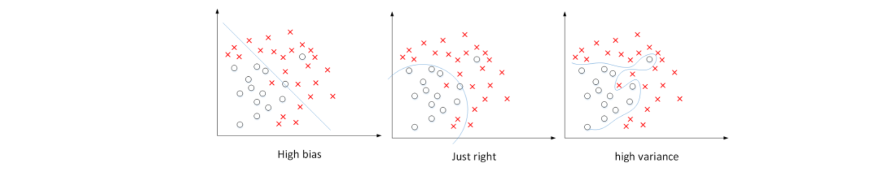
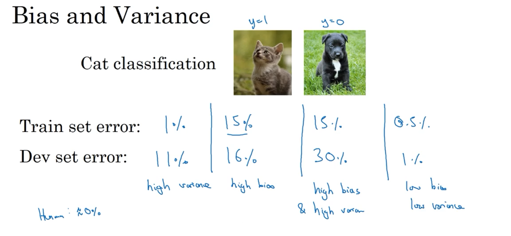
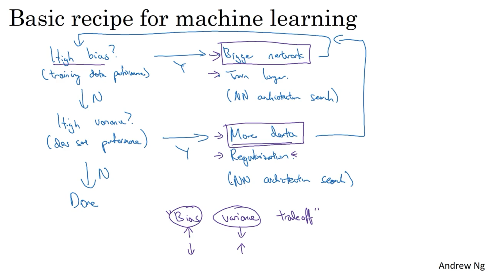
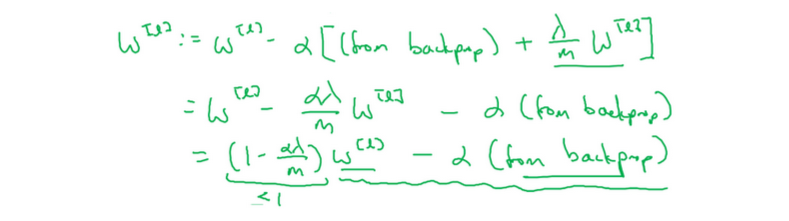
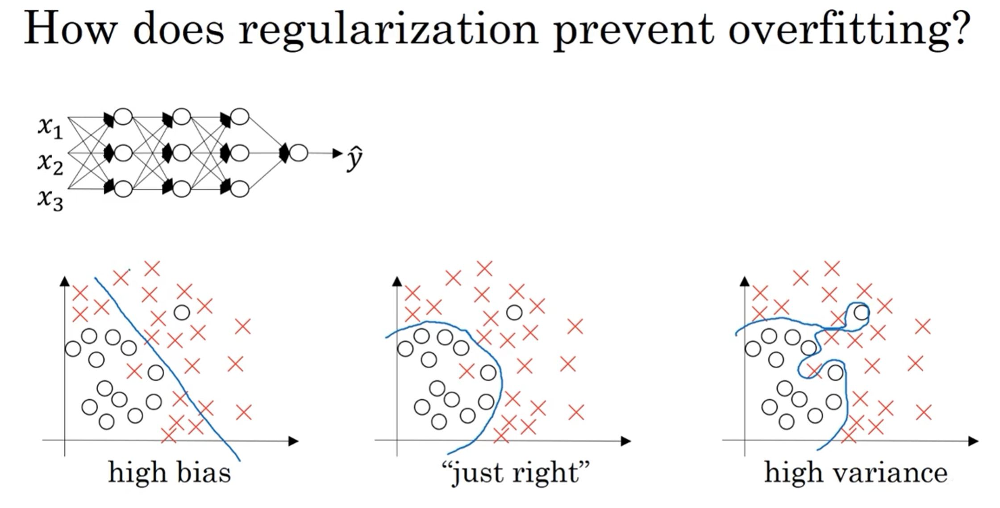
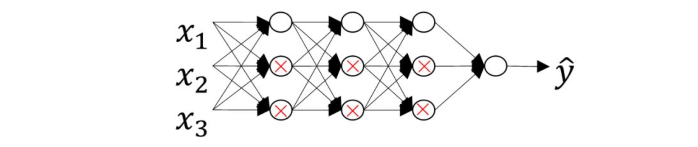
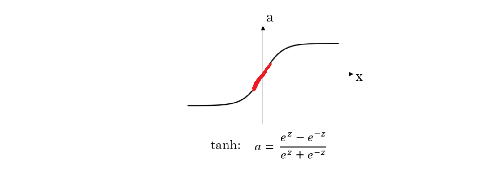

# 1.1 训练，验证，测试集（Train / Dev / Test sets）

## 数据集划分

一般我们将所有的样本数据分成三个部分：Train/Dev/Test sets。

- 训练集（Train sets）：用于训练深度学习模型。
- 验证集（Dev sets）：用于验证不同算法的表现，并选择最佳的算法模型。
- 测试集（Test sets）：用于测试最佳算法的实际表现，提供无偏估计。

## 数据集比例设定

- 通常设置Train sets和Test sets的数量比例为70%和30%。如果有Dev sets，则设置比例为60%、20%、20%，分别对应Train/Dev/Test sets。

- 对于大数据样本，可将 Dev sets 和 Test sets 的比例设置得更低，如 1% 或 0.5%。例如，对于 100 万样本，可以采用 98%/1%/1% 或 99%/0.5%/0.5% 的比例分配。

## 超参数优化

- 构建神经网络时需设置多个超参数，如层数、每个隐藏层神经元个数、学习速率、激活函数等。
- 通过反复迭代更新来获得最佳参数值。循环迭代过程包括：提出想法（Idea）、选择初始参数值、构建神经网络模型结构、通过代码实现神经网络、验证参数对应的神经网络性能。
- 通过多次循环调整参数并选择最佳参数值来优化神经网络性能。

## 训练效率提升

- 应用深度学习是一个反复迭代的过程，需要通过多次循环训练得到最优化参数。
- 循环训练的关键是单次循环所需时间，单次循环越快，训练过程越快。合适的 Train/Dev/Test sets 数量能有效提高训练效率。

# 1.2 偏差，方差（Bias /Variance）

## **偏差和方差的概念**

在传统的机器学习算法中，偏差(Bias)和方差(Variance)是对立的，分别对应着欠拟合和过拟合，我们常常需要在Bias和Variance之间进行权衡。

而在深度学习中，我们可以同时减小Bias和Variance，构建最佳神经网络模型。

## **偏差和方差的权衡**

  - 针对数据集，当使用简单模型（如逻辑回归）无法很好地拟合数据时，出现高偏差（high bias），即“欠拟合”（underfitting）。
  - 相反，当使用过于复杂的模型（如深度神经网络）能够完美拟合数据，但泛化能力较差时，出现高方差（high variance），即“过拟合”（overfitting）。
  - 介于过度拟合和欠拟合之间，存在一些适度拟合的模型，这种数据拟合看起来更加合理。

对于二维数据集，可以通过绘制数据和可视化分割边界来观察偏差和方差的情况。在多维空间数据中，虽无法直接绘制数据，但可以通过训练集误差和验证集误差研究偏差和方差。

## **训练集误差和验证集误差**

  - 关键数据包括训练集误差（Train set error）和验证集误差（Dev set error）。
  - 通过比较训练集误差和验证集误差，可以诊断算法是否具有高方差或高偏差。

##  **诊断算法的高偏差和高方差**

我们以识别猫狗为例，人类都能正确识别所有猫类图片
即base error为0。base error不同，相应的Train set error和Dev set error会有所变化，但没有相对变化。，对于此种情况：

  - **高方差**：假设Train set error为1%，而Dev set error为11%，即该算法模型对训练样本的识别很好，但是对验证集的识别却不太好。这说明了该模型对训练样本可能存在过拟合，模型泛化能力不强，导致验证集识别率低。这恰恰是high variance的表现。**训练集误差较低，但验证集误差较高，导致过度拟合。**

  - **高偏差**：假设Train set error为15%，而Dev set error为16%，虽然二者error接近，即该算法模型对训练样本和验证集的识别都不是太好。这说明了该模型对训练样本存在欠拟合。这恰恰是high bias的表现。**训练集误差和验证集误差都较高，导致欠拟合。**

  -  **高偏差&高方差**：  假设Train set error为15%，而Dev set error为30%，说明了该模型既存在high bias也存在high variance（深度学习中最坏的情况）。
  
   -  **低偏差&低方差**： 再假设Train set error为0.5%，而Dev set error为1%，即low bias和low variance，是最好的情况。

## **高偏差&高方差的情况**
一般来说，Train set error体现了是否出现bias，Dev set error体现了是否出现variance（正确地说，应该是Dev set error与Train set error的相对差值）。

我们已经通过二维平面展示了high bias或者high variance的模型，下图展示了high bias and high variance的模型：

模型既存在high bias也存在high variance，可以理解成某段区域是欠拟合的，某段区域是过拟合的。

## 如何减小high bias和high variance

- 减少high bias ：增加神经网络的隐藏层个数、神经元个数，训练时间延长，选择其它更复杂的NN模型等。

- 减少high variance ：增加训练样本数据，进行正则化Regularization，选择其他更复杂的NN模型等

# 1.3 机器学习基础（Basic Recipe for Machine Learning）

在训练神经网络时，我们需要考虑偏差（bias）和方差（variance）的问题。初始模型训练完成后，我们首先要评估算法的偏差水平。如果偏差较高，意味着模型无法很好地拟合训练集数据，可以选择一个新的网络架构，例如增加更多的隐藏层或隐藏单元，这样通常可以提升模型的拟合能力。另外，可以花费更多时间来训练网络，或者尝试使用更先进的优化算法。

一旦偏差降低到可接受的水平，我们需要检查方差的问题。如果方差较高，解决方案之一是增加更多的数据。然而，有时候我们无法获得更多的数据，这时我们可以尝试使用正则化方法来减少过拟合。

有时候，我们不得不反复尝试不同的方法。但是，如果能找到更合适的神经网络架构，有时候它可以同时减少偏差和方差。

# 1.4 正则化（Regularization）

如果出现了过拟合，可以通过扩大训练样本数量来减小方差，但是通常获得更多训练样本的成本太高，比较困难。所以，更可行有效的办法就是使用正则化（regularization）来解决。

常见正则化类型有L1正则化和L2正则化，其中L2正则化是最常用的。

## L2 regularization

L2正则化采用矩阵范数的平方来衡量模型复杂度，将矩阵中所有元素的平方和作为正则化项，并乘以正则化参数λ和系数1/2m，加入到损失函数中，从而减小参数的值。
$$\begin{gathered}J(w,b)=\frac1m\sum_{i=1}^mL(\hat{y}^{(i)},y^{(i)})+\frac\lambda{2m}||w||_2^2\\||w||_2^2=\sum_{j=1}^{n_x}w_j^2=w^Tw\end{gathered}$$

在神经网络中应用L2正则化：神经网络含有一个成本函数，该函数包含所有参数，其中正则项为$\frac{\lambda }{2m}{{\sum\nolimits_{1}^{L}{| {{W}^{[l]}}|}}^{2}}$，其中$L$是神经网络所含的层数。在梯度下降的过程中，将$dW$加上正则项$\frac{\lambda}{m}W$，从而实现L2正则化。L2正则化也被称为“权重衰减”，因为它乘以一个系数$(1 - \alpha\frac{\lambda}{m})$来减小权重指标。

## L1 regularization

$$\begin{gathered}J(w,b)=\frac1m\sum_{i=1}^mL(\hat{y}^{(i)},y^{(i)})+\frac\lambda{2m}||w||_1\\||w||_1=\sum_{j=1}^{nx}|w_j|\end{gathered}$$
使用L1正则化，正则项为$\frac{\lambda}{m}$乘以$\sum_{j= 1}^{n_{x}}{|w|}$，其中$\sum_{j =1}^{n_{x}}{|w|}$也被称为参数$w$向量的L1范数。使用L1正则化后，$w$最终会是稀疏的，即$w$向量中有很多0，但并不一定能够降低存储内存。

## 总结
正则化能够通过减小参数的值来降低模型的复杂度，从而防止过拟合的出现。
正则化的目的就是让权重w在一个约束范围内梯度下降并寻找最优解

# 1.5 为什么正则化有利于预防过拟合呢？（Why regularization reduces overfitting?）

假如我们选择了非常复杂的神经网络模型，如上图左上角所示。在未使用正则化的情况下，我们得到的分类超平面可能是类似上图右侧的过拟合。但是，如果使用L2 regularization,当$\lambda$很大时，$w^{[l]}\approx0$。$w^{[l]}$近似为零，意味着该神经网络模型中的某些神经元实际的作用很小，可以忽略。从效果上来看，其实是将某些神经元给忽略掉了。这样原本过于复杂的神经网络模型就变得不那么复杂了，而变得非常简单化了。如下图所示，整个简化的神经网络模型变成了一个逻辑回归模型。问题就从high variance变成了high bias 了。

还有另外一个直观的例子来解释为什么正则化能够避免发生过拟合。假设激活函数是tanh函数。tanh函数的特点是在z接近零的区域，函数近似是线性的，而当|z|很大的时候，函数非线性且变化缓慢。当使用正则化，$\lambda$较大，即对权重$w^{[l]}$的惩罚较大，$w^{[l]}$减小。因为$z^{[l]}=w^{[l]}a^{[l]}+b^{[l]}$，当$w^{[l]}$减小的时候，$z^{[l]}$也会减小。则此时的$z^{[l]}$分布在tanh函数的近似线性区域（下图红色部分）。那么这个神经元起的作用就相当于是linear regression。如果每个神经元对应的权重$w^{[l]}$都比较小，那么整个神经网络模型相当于是多个linear regression的组合，即可看成一个linear network。得到的分类超平面就会比较简单，不会出现过拟合现象。

# 1.6 dropout 正则化（Dropout Regularization）
因为丢了20%，所以a3的均值小了20%，除以0.8可以使均值大体上变化不大

因为你消除了80%，那么损失函数也会减少80%，但我们的目的只是消除一些节点的影响，而不影响整体，所以要除80%，恢复整体的权重

除以0.8是为了补偿归零项带来的损失

目的是确保即使在测试阶段不执行dropouts来调整数值范围，激活函数的预期结果也不会发生变化
# 1.7 理解 dropout（Understanding Dropout）

# 1.8 其他正则化方法（Other regularization methods）

# 1.9 归一化输入（Normalizing inputs）
提升网络训练速度：归一化
如果你用它来调整训练数据，那么用相同的μ和σ∧2来归一化测试集
# 1.10 梯度消失/梯度爆炸（Vanishing / Exploding gradients）

# 1.11 神经网络的权重初始化（Weight Initialization for Deep NetworksVanishing /Exploding gradients）

# 1.12 梯度的数值逼近（Numerical approximation of gradients）
中值定理，f（x）=（f（b）-f（a））/（b-a）

我们讲了如何使用双边误差来判断别人给你的函数g(Θ)是否正确实现了函数的偏导，现在我们可以使用这个方法来检验反向传播是否得以正确实施

# 1.13 梯度检验（Gradient checking）

用函数值去估计梯度，然后和记录下来的dw或者db比较，看是不是算对了
# 1.14 梯度检验应用的注意事项（Gradient Checking Implementation Notes）

