# 1.1 训练，验证，测试集（Train / Dev / Test sets）

## 数据集划分

一般我们将所有的样本数据分成三个部分：Train/Dev/Test sets。

- 训练集（Train sets）：用于训练深度学习模型。
- 验证集（Dev sets）：用于验证不同算法的表现，并选择最佳的算法模型。
- 测试集（Test sets）：用于测试最佳算法的实际表现，提供无偏估计。

## 数据集比例设定

- 通常设置Train sets和Test sets的数量比例为70%和30%。如果有Dev sets，则设置比例为60%、20%、20%，分别对应Train/Dev/Test sets。

- 对于大数据样本，可将 Dev sets 和 Test sets 的比例设置得更低，如 1% 或 0.5%。例如，对于 100 万样本，可以采用 98%/1%/1% 或 99%/0.5%/0.5% 的比例分配。

## 超参数优化

- 构建神经网络时需设置多个超参数，如层数、每个隐藏层神经元个数、学习速率、激活函数等。
- 通过反复迭代更新来获得最佳参数值。循环迭代过程包括：提出想法（Idea）、选择初始参数值、构建神经网络模型结构、通过代码实现神经网络、验证参数对应的神经网络性能。
- 通过多次循环调整参数并选择最佳参数值来优化神经网络性能。


## 训练效率提升

- 应用深度学习是一个反复迭代的过程，需要通过多次循环训练得到最优化参数。
- 循环训练的关键是单次循环所需时间，单次循环越快，训练过程越快。合适的 Train/Dev/Test sets 数量能有效提高训练效率。


# 1.2 偏差，方差（Bias /Variance）

## **偏差和方差的概念**

在传统的机器学习算法中，偏差(Bias)和方差(Variance)是对立的，分别对应着欠拟合和过拟合，我们常常需要在Bias和Variance之间进行权衡。

而在深度学习中，我们可以同时减小Bias和Variance，构建最佳神经网络模型。


## **偏差和方差的权衡**

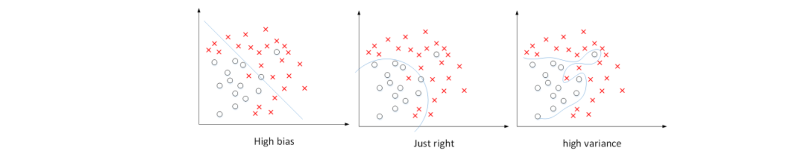
  - 针对数据集，当使用简单模型（如逻辑回归）无法很好地拟合数据时，出现高偏差（high bias），即“欠拟合”（underfitting）。
  - 相反，当使用过于复杂的模型（如深度神经网络）能够完美拟合数据，但泛化能力较差时，出现高方差（high variance），即“过拟合”（overfitting）。
  - 介于过度拟合和欠拟合之间，存在一些适度拟合的模型，这种数据拟合看起来更加合理。

对于二维数据集，可以通过绘制数据和可视化分割边界来观察偏差和方差的情况。在多维空间数据中，虽无法直接绘制数据，但可以通过训练集误差和验证集误差研究偏差和方差。

## **训练集误差和验证集误差**

  - 关键数据包括训练集误差（Train set error）和验证集误差（Dev set error）。
  - 通过比较训练集误差和验证集误差，可以诊断算法是否具有高方差或高偏差。

##  **诊断算法的高偏差和高方差**

我们以识别猫狗为例，人类都能正确识别所有猫类图片
即base error为0。base error不同，相应的Train set error和Dev set error会有所变化，但没有相对变化。，对于此种情况：

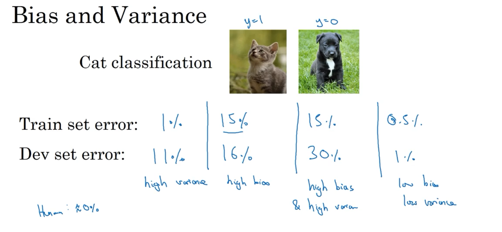

  - **高方差**：假设Train set error为1%，而Dev set error为11%，即该算法模型对训练样本的识别很好，但是对验证集的识别却不太好。这说明了该模型对训练样本可能存在过拟合，模型泛化能力不强，导致验证集识别率低。这恰恰是high variance的表现。**训练集误差较低，但验证集误差较高，导致过度拟合。**


  - **高偏差**：假设Train set error为15%，而Dev set error为16%，虽然二者error接近，即该算法模型对训练样本和验证集的识别都不是太好。这说明了该模型对训练样本存在欠拟合。这恰恰是high bias的表现。**训练集误差和验证集误差都较高，导致欠拟合。**

  -  **高偏差&高方差**：  假设Train set error为15%，而Dev set error为30%，说明了该模型既存在high bias也存在high variance（深度学习中最坏的情况）。
  
   -  **低偏差&低方差**： 再假设Train set error为0.5%，而Dev set error为1%，即low bias和low variance，是最好的情况。

## **高偏差&高方差的情况**
一般来说，Train set error体现了是否出现bias，Dev set error体现了是否出现variance（正确地说，应该是Dev set error与Train set error的相对差值）。

我们已经通过二维平面展示了high bias或者high variance的模型，下图展示了high bias and high variance的模型：
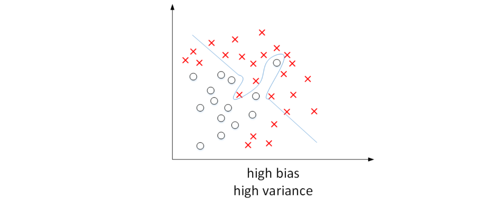
模型既存在high bias也存在high variance，可以理解成某段区域是欠拟合的，某段区域是过拟合的。

## 如何减小high bias和high variance

- 减少high bias ：增加神经网络的隐藏层个数、神经元个数，训练时间延长，选择其它更复杂的NN模型等。

- 减少high variance ：增加训练样本数据，进行正则化Regularization，选择其他更复杂的NN模型等


# 1.3 机器学习基础（Basic Recipe for Machine Learning）

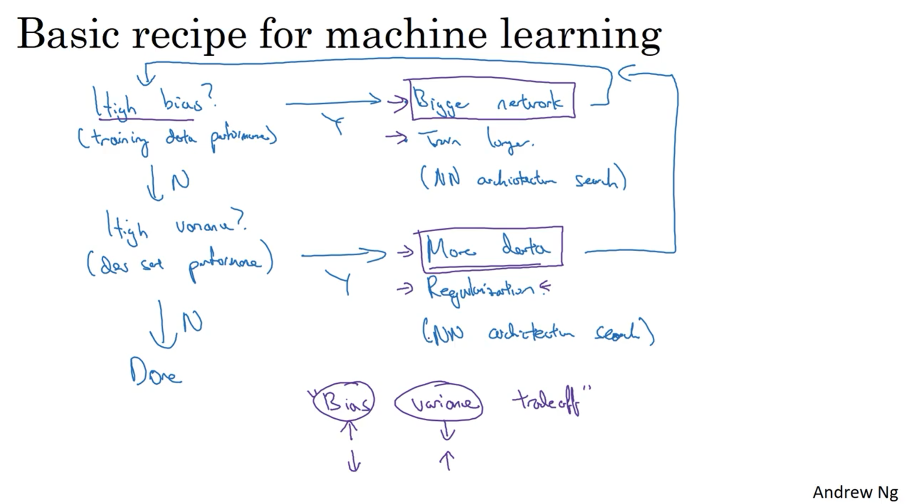

在训练神经网络时，我们需要考虑偏差（bias）和方差（variance）的问题。初始模型训练完成后，我们首先要评估算法的偏差水平。如果偏差较高，意味着模型无法很好地拟合训练集数据，可以选择一个新的网络架构，例如增加更多的隐藏层或隐藏单元，这样通常可以提升模型的拟合能力。另外，可以花费更多时间来训练网络，或者尝试使用更先进的优化算法。

一旦偏差降低到可接受的水平，我们需要检查方差的问题。如果方差较高，解决方案之一是增加更多的数据。然而，有时候我们无法获得更多的数据，这时我们可以尝试使用正则化方法来减少过拟合。

有时候，我们不得不反复尝试不同的方法。但是，如果能找到更合适的神经网络架构，有时候它可以同时减少偏差和方差。

# 1.4 正则化（Regularization）

如果出现了过拟合，可以通过扩大训练样本数量来减小方差，但是通常获得更多训练样本的成本太高，比较困难。所以，更可行有效的办法就是使用正则化（regularization）来解决。

常见正则化类型有L1正则化和L2正则化，其中L2正则化是最常用的。

## L2 regularization

L2正则化采用矩阵范数的平方来衡量模型复杂度，将矩阵中所有元素的平方和作为正则化项，并乘以正则化参数λ和系数1/2m，加入到损失函数中，从而减小参数的值。将之前的Logistic regression采用L2 regularization 为：
$$\begin{gathered}J(w,b)=\frac1m\sum_{i=1}^mL(\hat{y}^{(i)},y^{(i)})+\frac\lambda{2m}||w||_2^2\\||w||_2^2=\sum_{j=1}^{n_x}w_j^2=w^Tw\end{gathered}$$

在神经网络中应用L2正则化：
$$\begin{gathered}\begin{aligned}J(w^{[1]},b^{[1]},\cdots,w^{[L]},b^{[L]})&=\frac1m\sum_{i=1}^mL(\hat{y}^{(i)},y^{(i)})+\frac\lambda{2m}\sum_{l=1}^L||w^{[l]}||^2\\\\||w^{[l]}||^2&=\sum_{i=1}^{n^{[l]}}\sum_{j=1}^{n^{[l-1]}}(w_{ij}^{[l]})^2\end{aligned}\end{gathered}$$

神经网络含有一个成本函数，该函数包含所有参数，其中正则项为$\frac\lambda{2m}\sum_{l=1}^L||w^{[l]}||^2$，其中$L$是神经网络所含的层数。

由于加入了正则化项，梯度下降算法中的计算表达式需要做如下修改：
$$\begin{gathered}dw^{[l]}=dw_{before}^{[l]}+\frac\lambda mw^{[l]}\\\\w^{[l]}:=w^{[l]}-\alpha\cdot dw^{[l]}\end{gathered}$$
L2正则化也被称为“权重衰减(weight decay)”，因为它乘以一个系数$(1 - \alpha\frac{\lambda}{m})$来减小权重指标。不断迭代更新，不断地减小。
$$\begin{aligned}
w^{[l]}& :=w^{[l]}-\alpha\cdot dw^{[l]}  \\
&=w^{[l]}-\alpha\cdot(dw_{before}^{[l]}+\frac\lambda mw^{[l]}) \\
&=(1-\alpha\frac\lambda m)w^{[l]}-\alpha\cdot dw_{before}^{[l]}
\end{aligned}$$

## L1 regularization
$$\begin{gathered}J(w,b)=\frac1m\sum_{i=1}^mL(\hat{y}^{(i)},y^{(i)})+\frac\lambda{2m}||w||_1\\||w||_1=\sum_{j=1}^{nx}|w_j|\end{gathered}$$
使用L1正则化，正则项为$\frac{\lambda}{m}$乘以$\sum_{j= 1}^{n_{x}}{|w|}$，其中$\sum_{j =1}^{n_{x}}{|w|}$也被称为参数$w$向量的L1范数。使用L1正则化后，$w$最终会是稀疏的，即$w$向量中有很多0，其优点是能够降低存储内存。

然而，实际上L1 regularization在解决high variance方面比L2 regularization并不更具优势。而且，L1的在微分求导方面比较复杂。所以，一般L2 regularization更加常用。


## 总结
正则化能够通过减小参数的值来降低模型的复杂度，从而防止过拟合的出现。
正则化的目的就是让权重w在一个约束范围内梯度下降并寻找最优解

# 1.5 为什么正则化有利于预防过拟合呢？（Why regularization reduces overfitting?）
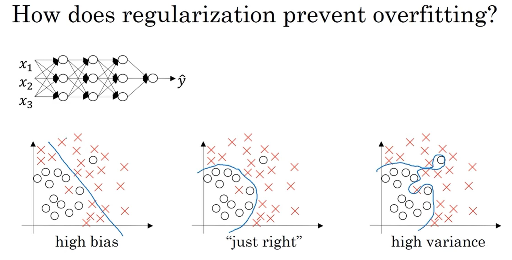

假如我们选择了非常复杂的神经网络模型，如上图左上角所示。在未使用正则化的情况下，我们得到的分类超平面可能是类似上图右侧的过拟合。但是，如果使用L2 regularization,当$\lambda$很大时，$w^{[l]}\approx0$。$w^{[l]}$近似为零，意味着该神经网络模型中的某些神经元实际的作用很小，可以忽略。

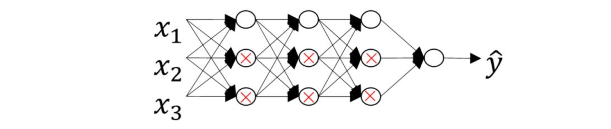

从效果上来看，其实是将某些神经元给忽略掉了。这样原本过于复杂的神经网络模型就变得不那么复杂了，而变得非常简单化了。如上图所示，整个简化的神经网络模型变成了一个逻辑回归模型。问题就从high variance变成了high bias 了。

还有另外一个直观的例子来解释为什么正则化能够避免发生过拟合。假设激活函数是tanh函数。tanh函数的特点是在z接近零的区域，函数近似是线性的，而当|z|很大的时候，函数非线性且变化缓慢。当使用正则化，$\lambda$较大，即对权重$w^{[l]}$的惩罚较大，$w^{[l]}$减小。因为$z^{[l]}=w^{[l]}a^{[l]}+b^{[l]}$，当$w^{[l]}$减小的时候，$z^{[l]}$也会减小。则此时的$z^{[l]}$分布在tanh函数的近似线性区域（下图红色部分）。那么这个神经元起的作用就相当于是linear regression。如果每个神经元对应的权重$w^{[l]}$都比较小，那么整个神经网络模型相当于是多个linear regression的组合，即可看成一个linear network。得到的分类超平面就会比较简单，不会出现过拟合现象。
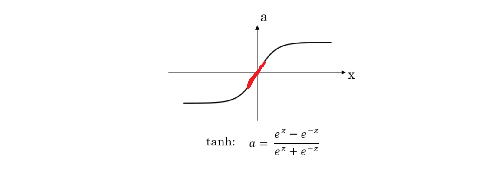

# 1.6 Dropout（Dropout）

除了L2 regularization之外，还有另外一种防止过拟合的有效方法：Dropout。

Dropout是指在深度学习网络的训练过程中，对于每层的神经元，按照一定的概率将其暂时从网络中丢弃。也就是说，每次训练时，每一层都有部分神经元不工作，起到简化复杂网络模型的效果，从而避免发生过拟合。

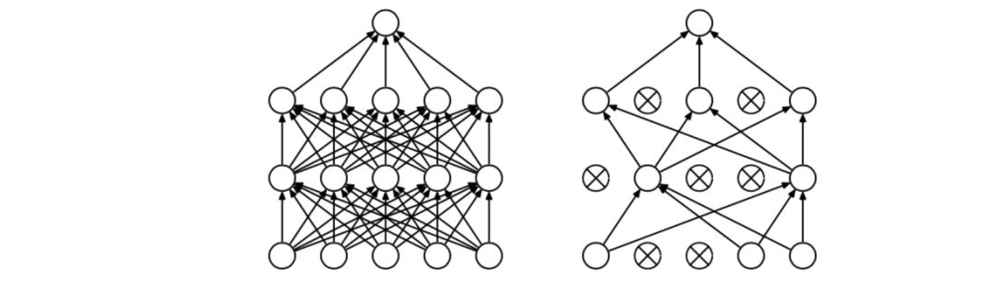

Dropout有不同的实现方法，接下来介绍一种常用的方法：Inverted dropout。

（1）假设对于第l层神经元，设定保留神经元比例概率keep_prob=0.8，即该层有20%的神经元停止工作。

（2）dl为dropout向量，设置dl为随机vector，其中80%的元素为1，20%的元素为0。在python中可以使用如下语句生成dropout vector：

```python
dl = np.random.rand(al.shape[0],al.shape[1])<keep_prob
```

（3）然后，第l层经过dropout，随机删减20%的神经元，只保留80%的神经元，其输出为：

```python
al = np.multiply(al,dl)
```

（4）最后，还要对al进行scale up处理，即：

```python
al /= keep_prob
```

以上就是Inverted dropout的方法。之所以要对al进行scale up是为了保证在经过dropout后，al作为下一层神经元的输入值尽量保持不变。

假设第l层有50个神经元，经过dropout后，有10个神经元停止工作，这样只有40个神经元有作用。

那么得到的al只相当于原来的80%，期望值小了20%。scale up后，能够尽可能保持al的期望值相比之前没有大的变化，不影响整体。

Inverted dropout的另外一个好处就是在对该dropout后的神经网络进行测试时能够减少scaling问题。

因为在训练时，使用scale up保证al的期望值没有大的变化，测试时就不需要再对样本数据进行类似的尺度伸缩操作了。

# 1.7 理解 dropout（Understanding Dropout）

## Dropout基本概念
在每次迭代训练时，随机删除掉隐藏层一定数量的神经元；然后，在删除后的剩下的神经元上进行正向和反向更新权重w和常数项b；接着，下一次迭代中，再恢复之前删除的神经元，重新随机删除一定数量的神经元，进行正向和反向更新w和b。不断重复上述过程，直至迭代训练完成。

值得注意的是，使用dropout训练结束后，在测试和实际应用模型时，不需要进行dropout和随机删减神经元，所有的神经元都在工作。

## Dropout防止过拟合的原理

Dropout通过每次迭代训练时，随机选择不同的神经元，相当于每次都在不同的神经网络上进行训练，类似机器学习中Bagging的方法，能够防止过拟合。


## 从权重w的角度解释防止过拟合的原理


对于某个神经元来说，某次训练时，它的某些输入在dropout的作用被过滤了。而在下一次训练时，又有不同的某些输入被过滤。经过多次训练后，某些输入被过滤，某些输入被保留。

这样，该神经元就不会受某个输入非常大的影响，影响被均匀化了。也就是说，对应的权重w不会很大。

这从效果上来说，与L2 regularization是类似的，都是对权重w进行“惩罚”，减小了w的值。


总的来说，对于同一组训练数据，利用不同的神经网络训练之后，求其输出的平均值可以减少过拟合。

Dropout就是利用这个原理，每次丢掉一定数量的隐藏层神经元，相当于在不同的神经网络上进行训练，这样就减少了神经元之间的依赖性，即每个神经元不能依赖于某几个其他的神经元（指层与层之间相连接的神经元），使神经网络更加能学习到与其他神经元之间的更加健壮robust的特征。

## 注意事项

首先，不同隐藏层的dropout系数keep_prob可以不同。一般来说，神经元越多的隐藏层，keep_out可以设置得小一些，例如0.5；神经元越少的隐藏层，keep_out可以设置的大一些，例如0.8，设置是1。

另外，实际应用中，不建议对输入层进行dropout，如果输入层维度很大，例如图片，那么可以设置dropout，但keep_out应设置的大一些，例如0.8，0.9。

总体来说，就是越容易出现overfitting的隐藏层，其keep_prob就设置的相对小一些。没有准确固定的做法，通常可以根据validation进行选择。

Dropout在电脑视觉CV领域应用比较广泛，因为输入层维度较大，而且没有足够多的样本数量。

值得注意的是dropout是一种regularization技巧，用来防止过拟合的，最好只在需要regularization的时候使用dropout。

使用dropout的时候，可以通过绘制cost function来进行debug，看看dropout是否正确执行。一般做法是，将所有层的keep_prob全设置为1，再绘制cost function，即涵盖所有神经元，看J是否单调下降。下一次迭代训练时，再将keep_prob设置为其它值。

# 1.8 其他正则化方法（Other regularization methods）
## 数据增强
除了L2 regularization和dropout regularization之外，还有其它减少过拟合的方法。

其中一种方法是增加训练样本数量。但是通常成本较高，难以获得额外的训练样本。但是，我们可以对已有的训练样本进行一些处理来“制造”出更多的样本，称为data augmentation。

例如图片识别问题中，可以对已有的图片进行水平翻转、任意角度旋转、缩放或扩大等等。


这些处理都能“制造”出新的训练样本。虽然这些是基于原有样本的，但是对增大训练样本数量还是有很有帮助的，不需要增加额外成本，却能起到防止过拟合的效果。

## early stopping

一个神经网络模型随着迭代训练次数增加，train set error一般是单调减小的，而dev set error 先减小，之后又增大。

也就是说训练次数过多时，模型会对训练样本拟合的越来越好，但是对验证集拟合效果逐渐变差，即发生了过拟合。

因此，迭代训练次数不是越多越好，可以通过train set error和dev set error随着迭代次数的变化趋势，选择合适的迭代次数，即early stopping。
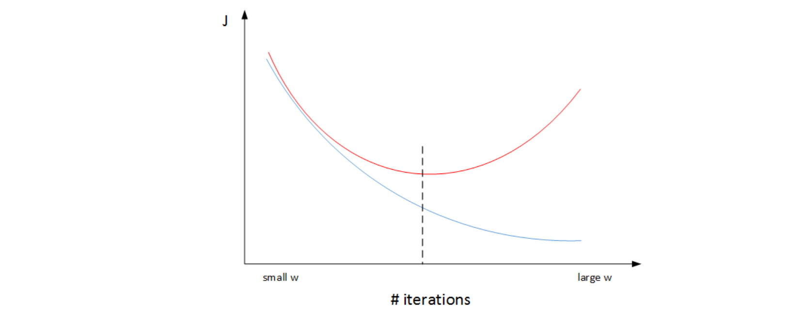


然而，Early stopping有其自身缺点。通常来说，机器学习训练模型有两个目标：一是优化cost function，尽量减小J；二是防止过拟合。

这两个目标彼此对立的，即减小J的同时可能会造成过拟合，反之亦然。我们把这二者之间的关系称为正交化orthogonalization。

在深度学习中，我们可以同时减小Bias和Variance，构建最佳神经网络模型。

但是，Early stopping的做法通过减少迭代次数来防止过拟合，这样J就不会足够小。也就是说，early stopping将上述两个目标融合在一起，同时优化，但可能没有“分而治之”的效果好。

与early stopping相比，L2 regularization可以实现“分而治之”的效果：迭代训练足够多，可以减小J，而且也能有效防止过拟合。

而L2 regularization的缺点之一是最优的正则化参数λ的选择比较复杂。

对这一点来说，early stopping比较简单。总的来说，L2 regularization更加常用一些。

# 1.9 归一化输入（Normalizing inputs）

在训练神经网络时，标准化输入可以提高训练的速度。标准化输入就是对训练数据集进行归一化的操作，即将原始数据减去其均值μ后，再除以其方差σ^2：
$$\begin{gathered}
\mu=\frac{1}{m}\sum_{i=1}^{m}X^{(i)} \\
\sigma^{2}=\frac1m\sum_{i=1}^{m}(X^{(i)})^{2} \\
\begin{aligned}X:=\frac{X-\mu}{\sigma^2}\end{aligned} 
\end{gathered}$$
以二维平面为例，下图展示了其归一化过程：

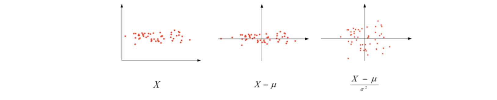

值得注意的是，由于训练集进行了标准化处理，那么对于测试集或在实际应用时，应该使用同样的μ和σ^2对其进行标准化处理。这样保证了训练集合测试集的标准化操作一致。

之所以要对输入进行标准化操作，主要是为了让所有输入归一化同样的尺度上，方便进行梯度下降算法时能够更快更准确地找到全局最优解。(原理可参考机器学习笔记->0监督学习->特征缩放)

# 1.10 梯度消失/梯度爆炸（Vanishing / Exploding gradients）

在神经网络尤其是深度神经网络中存在可能存在这样一个问题：梯度消失和梯度爆炸。

意思是当训练一个层数非常多的神经网络时，计算得到的梯度可能非常小或非常大，甚至是指数级别的减小或增大。这样会让训练过程变得非常困难。


为了简化复杂度，便于分析，我们令各层的激活函数为线性函数，即$g(Z)=Z$。且忽略各层常数项b的影响，令b全部为零。那么，该网络的预测输出$\hat{Y}$为：

 $\hat{Y}=W^{[L]}W^{[L-1]}W^{[L-2]}\ldots W^{[3]}W^{[2]}W^{[1]}X$
如果各层权重$W^{[l]}$的元素都稍大于1，例如1.5, 则预测输出$\hat{Y}$将正比于$1.5^L$。L越大，$\hat{Y}$越大，且呈指数型增长。我们称之为数值爆炸。
相反，如果各层权重$W^{[l]}$的元素都稍小于1，例如0.5,则预测输出$\hat{Y}$将正比于$0.5^L$。网络层数L越多，$\hat{Y}$呈指数型减小。我们称之为数值消失。

也就是说，如果各层权重$W^{[l]}$都大于1或者都小于1，那么各层激活函数的输出将随着层数$l$的增加，呈指数型增大或减小。当层数很大时，出现数值爆炸或消失。同样，这种情况也会引起梯度呈现同样的指数型增大或减小的变化。L非常大时，例如L=150,则梯度会非常大或非常小，引起每次更新的步进长度过大或者过小，这让训练变得十分困难。

# 1.11 神经网络的权重初始化（Weight Initialization for Deep NetworksVanishing /Exploding gradients）
下面介绍如何改善梯度消失/梯度爆炸这类问题，方法是对权重w进行一些初始化处理。

如果激活函数是tanh，在初始化w时，令其方差为1/n。相应的python伪代码为：
```python
w[l] = np.random.randn(n[l],n[l-1])*np.sqrt(1/n[l-1])
```

如果激活函数是ReLU，权重w的初始化一般令其方差为2/n：
```python
w[l] = np.random.randn(n[l],n[l-1])*np.sqrt(2/n[l-1])
```

除此之外，Yoshua Bengio提出了另外一种初始Bengio提出了另外一种初始化w的方法,令其方差为：$\frac2{n^{[l-1]}n^{[l]}}$
```python
w[l] = np.random.randn(n[l],n[l-1])*np.sqrt(2/n[l-1]*n[l])
```


# 1.12 梯度检验（Gradient checking）
Back Propagation神经网络有一项重要的测试是梯度检查（gradient checking）。其目的是检查验证反向传播过程中梯度下降算法是否正确。

## 梯度的数值逼近

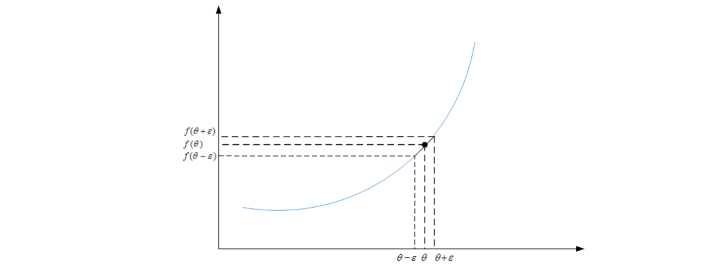

利用微分思想（中值定理$f(x)=(f(b)-f(a))/(b-a)$），函数f在点θ处的梯度可以表示成：
$$g(\theta)=\frac{f(\theta+\varepsilon)-f(\theta-\varepsilon)}{2\varepsilon}$$
其中，ε>0，且足够小。

函数f在点θ处的梯度近似等于$g(\theta)$的值。

## 梯度检验
用函数值去估计梯度，然后和记录下来的dw或者db比较，看是不是算对了

梯度检查首先要做的是分别将$W^{[1]},b^{[1]},\cdots,W^{[L]},b^{[L]}$这些矩阵构造成一维向量，然后将这些一维向量组合起来构成一个更大的一维 向 量 $\theta$。这 样 cost function $J(W^{[1]},b^{[1]},\ldots,W^{[L]},b^{[L]})$ 就 可以表示成$J(\theta)$。

 然后将反向传播过程通过梯度下降算法得到的
 $dW^{[1]},db^{[1]},\cdots,dW^{[L]},db^{[L]}$按照一样的顺序构造成一个一维向量$d\theta$。$d\theta$的维度与$\theta$一致。

 接着利用$J(\theta)$对每个$\theta_i$计算近似梯度，其值与反
 向传播算法得到的$d\theta_i$相比较，检查是否一致。例如，对于第i个元素，近似梯度为：
$$d\theta_{approx}[i]=\frac{J(\theta_1,\theta_2,\cdots,\theta_i+\varepsilon,\cdots)-J(\theta_1,\theta_2,\cdots,\theta_i-\varepsilon,\cdots)}{2\varepsilon}$$

计算完所有$\theta_i$的近似梯度后，可以计算$d\theta_{approx}$与$d\theta$的欧氏(Euclidean) 距离来比较二者的相似度。公式如下：

$$\frac{||d\theta_{approx}-d\theta||_2}{||d\theta_{approx}||_2+||d\theta||_2}$$

一般来说，如果欧氏距离越小，例如$10^{-7}$,甚至更小，则表明$d\theta_{approx}$与$d\theta$越接近，即反向梯度计算是正确的，没有bugs。

如果欧氏距离较大， 例如$10^{-5}$,则表明梯度计算可能出现问题，需要再次检查是否有bugs存在。

如果欧氏距离很大，例如$10^{-3}$,甚至更大，则表明$d\theta_{approx}$与$d\theta$差别很大，梯度下降计算过程有bugs，需要仔细检查。


## 梯度检验应用的注意事项

- 不要在整个训练过程中都进行梯度检查，仅仅作为debug使用。

 - 如果梯度检查出现错误，找到对应出错的梯度，检查其推导是否出现错误。

 - 注意不要忽略正则化项，计算近似梯度的时候要包括进去。

 - 梯度检查时关闭dropout，检查完毕后再打开dropout。

 - 随机初始化时运行梯度检查，经过一些训练后再进行梯度检查（不常用）。