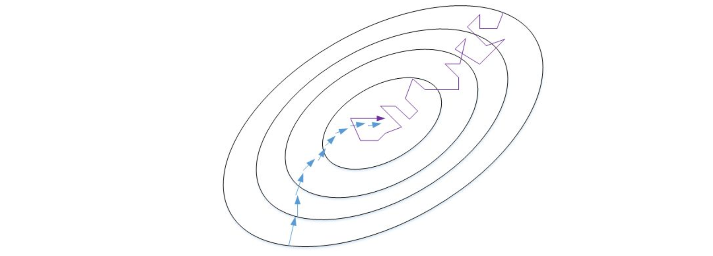
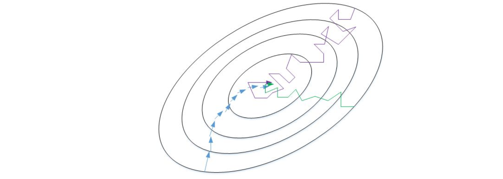
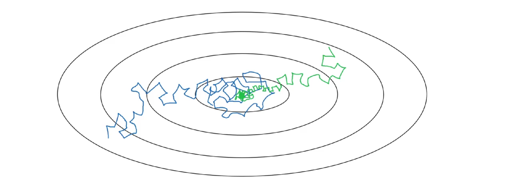

# 1 Mini-batch梯度下降

之前我们介绍的神经网络训练过程是对所有m个样本，称为batch，通过向量化计算方式，同时进行的。

如果m很大，例如达到百万数量级，训练速度往往会很慢，因为每次迭代都要对所有样本进行求和运算和矩阵运算。我们将这种梯度下降算法称为Batch Gradient Descent。

为了解决这一问题，我们可以把m个训练样本分成若干个子集，称为mini-batches，这样每个子集包含的数据量就小了，例如只有1000，然后每次在单一子集上进行神经网络训练，速度就会大大提高。这种梯度下降算法叫做Mini-batch Gradient Descent。

假设总的训练样本个数m=5000000,其维度为$(n_x,m)$。将其分成5000个子集，每个mini-batch含有1000个样本。我们将每个mini-batch记为$X^{\{t\}}$,其维度为$(n_x,1000)$。相应的每个mini-batch的输出记为$Y^{\{t\}}$,其 维 度 为 (1,1000)，且$t=1,2,\cdots,5000$。

这里顺便总结一下我们遇到的神经网络中几类字母的上标含义：

$X^{(i)}:$ 第i个样本
$Z^{[l]}:$ 神经网络第$l$层网络的线性输出
$X^{\{t\}},Y^{\{t\}}:$ 第t组mini-batch


Mini-batches Gradient Descent的实现过程是先将总的训练样本分成T个子集（mini-batches），然后对每个mini-batch进行神经网络训练，包括向前传播，计算Cost Function，反向传播，循环至T个mini-batch都训练完毕。

```
for  t=1,⋯,T {
    Forward Propagation
    ComputeCostFunction
    BackwardPropagation
    W:=W−α⋅dW
    b:=b−α⋅db
}
```

经过T次循环之后，所有m个训练样本都进行了梯度下降计算。这个过程，我们称之为经历了一个epoch。

对于Batch Gradient Descent而言，一个epoch只进行一次梯度下降算法；而Mini-Batches Gradient Descent，一个epoch会进行T次梯度下降算法。

值得一提的是，对于Mini-Batches Gradient Descent，可以进行多次epoch训练。而且，每次epoch，最好是将总体训练数据重新打乱、重新分成T组mini-batches，这样有利于训练出最佳的神经网络模型。

Batch gradient descent和Mini-batch gradient descent的cost曲线如下图所示：


对于一般的神经网络模型，使用Batch gradient descent，随着迭代次数增加，cost是不断减小的。然而，使用Mini-batch gradient descent，随着在不同的mini-batch上迭代训练，其cost不是单调下降，而是受类似noise的影响，出现振荡。但整体的趋势是下降的，最终也能得到较低的cost值。

之所以出现细微振荡的原因是不同的mini-batch之间是有差异的。例如可能第一个子集$(X^{\{1\}},Y^{\{1\}})$是好的子集，而第二个子集$(X^{\{2\}},Y^{\{2\}})$包含了一些噪声noise。出现细微振荡是正常的。

如何选择每个mini-batch的大小，即包含的样本个数呢？有两个极端：如果mini-batch size=m ,即为Batch gradient descent ,只包含一个子集 为$(X^{\{1\}},Y^{\{1\}})=(X,Y)$ ;如果mini-batch size=1 , 即为Stachastic gradient descent,每个样本就是一个子集$(X^{\{1\}},Y^{\{1\}})=(x^{(i)},y^{(i)})$ ,共有m个子集。


我们来比较一下Batch gradient descent和Stachastic gradient descent的梯度下降曲线。


如图所示，蓝色的线代表Batch gradient descent，紫色的线代表Stachastic gradient descent。

Batch gradient descent会比较平稳地接近全局最小值，但是因为使用了所有m个样本，每次前进的速度有些慢。

Stachastic gradient descent每次前进速度很快，但是路线曲折，有较大的振荡，最终会在最小值附近来回波动，难以真正达到最小值处。而且在数值处理上就不能使用向量化的方法来提高运算速度。

实际使用中，mini-batch size不能设置得太大（Batch gradient descent），也不能设置得太小（Stachastic gradient descent）。

这样，相当于结合了Batch gradient descent和Stachastic gradient descent各自的优点，既能使用向量化优化算法，又能较快速地找到最小值。

mini-batch gradient descent的梯度下降曲线如下图绿色所示，每次前进速度较快，且振荡较小，基本能接近全局最小值。

一般来说，如果总体样本数量m不太大时，例如m≤2000m≤2000，建议直接使用Batch gradient descent。

如果总体样本数量m很大时，建议将样本分成许多mini-batches。推荐常用的mini-batch size为64,128,256,512。这些都是2的幂。

之所以这样设置的原因是计算机存储数据一般是2的幂，这样设置可以提高运算速度。

# 2 指数加权平均

## 指数加权平均概念
该部分我们将介绍指数加权平均（Exponentially weighted averages）的概念。

我们记录半年内伦敦市的气温变化，并在二维平面上绘制出来，如下图所示：


如果我们希望看到半年内气温的整体变化趋势，可以通过移动平均（moving average）的方法来对每天气温进行平滑处

例如我们可以设V0=0，当成第0天的气温值。

第一天的气温与第0天的气温有关：
$$V_1=0.9V_0+0.1\theta_1$$

第二天的气温与第一天的气温有关：
$$V_2=0.9V_1+0.1\theta_2$$

第三天的气温与第二天的气温有关：
$$V_3=0.9V_2+0.1\theta_3$$

即第t天与第t-1天的气温迭代关系为：
$$V_t=0.9V_{t-1}+0.1\theta_t$$

经过移动平均处理得到的气温如下图红色曲线所示：

这种滑动平均算法称为指数加权平均（exponentially weighted average）。根据之前的推导公式，其一般形式为：
$$V_t=\beta V_{t-1}+(1-\beta)\theta_t$$

上面的例子中，β=0.9。β值决定了指数加权平均的天数，近似表示为$\frac1{1-\beta}$

例如，当$\beta=0.9$,则$\frac{1}{1-\beta}=10$,表示将前10天进行指数加权平均。当$\beta=0.98$,则$\frac{1}{1-\beta}=50$,表示将前50天进行指数加权平均。$\beta$值越大，则指数加权平均的天数越多，平均后的趋势线就越平缓，但是同时也会向右平移。下图绿色曲线和黄色曲线分别表示了$\beta=0.98$和$\beta=0.5$时，指数加权平均的结果。


这里简单解释一下公式1/(1−β)是怎么来的。准确来说，指数加权平均算法跟之前所有天的数值都有关系，根据之前的推导公式就能看出。

但是指数是衰减的，一般认为衰减到1/e就可以忽略不计了。因此，根据之前的推导公式，我们只要证明下式就好了：
$$
\beta^{\frac1{1-\beta}}=\frac1e
$$
令$\frac{1}{1-\beta}=N$ ,$N>0$ ,则$\beta=1-\frac{1}{N}$ ,$\frac{1}{N}<1$。即证明转化为：
$$(1-\frac1N)^N=\frac1e$$

显然，当N>>0时，上述等式是近似成立的。

至此，简单解释了为什么指数加权平均的天数的计算公式为1/(1−β)。

## 偏差修正
上文中提到当β=0.98时，指数加权平均结果如下图绿色曲线所示。但是实际上，真实曲线如紫色曲线所示。

我们注意到，紫色曲线与绿色曲线的区别是，紫色曲线开始的时候相对较低一些。这是因为开始时我们设置V0=0，所以初始值会相对小一些，直到后面受前面的影响渐渐变小，趋于正常。

修正这种问题的方法是进行偏移校正（bias correction），即在每次计算完Vt后，对Vt进行下式处理：$\frac{V_t}{1-\beta^t}$

在刚开始的时候，t比较小，$(1-\beta^t)<1$,这样就将$V_t$修正得更大一些，效果是把紫色曲线开始部分向上提升一些，与绿色曲线接近重合。随着t增大$(1-\beta^t)\approx1$，$V_t$基本不变，紫色曲线与绿色曲线依然重合。这样就实现了简单的偏移校正，得到我们希望的绿色曲线。

值得一提的是，机器学习中，偏移校正并不是必须的。因为，在迭代一次次后（t较大），Vt受初始值影响微乎其微，紫色曲线与绿色曲线基本重合。所以，一般可以忽略初始迭代过程，等到一定迭代之后再取值，这样就不需要进行偏移校正了。

# 3 动量梯度下降算法

该部分将介绍动量梯度下降算法，其速度要比传统的梯度下降算法快很多。做法是在每次训练时，对梯度进行指数加权平均处理，然后用得到的梯度值更新权重W和常数项b。下面介绍具体的实现过程。

原始的梯度下降算法如上图蓝色折线所示。在梯度下降过程中，梯度下降的振荡较大，尤其对于W、b之间数值范围差别较大的情况。此时每一点处的梯度只与当前方向有关，产生类似折线的效果，前进缓慢。

而如果对梯度进行指数加权平均，这样使当前梯度不仅与当前方向有关，还与之前的方向有关，这样处理让梯度前进方向更加平滑，减少振荡，能够更快地到达最小值处。

这是因为之前的梯度方向可以保证是大致指向极小值方向的，而当前的可能是也可能不是，因此如果是，则用之前的梯度加强其收敛速度，否则用之前的去抵消以减弱收敛速度，这种方法的问题即容易积累动量从而越过极小值。

权重W和常数项b的指数加权平均表达式如下：
$$\begin{aligned}V_{dW}&=\beta\cdot V_{dW}+(1-\beta)\cdot dW\\V_{db}&=\beta\cdot V_{db}+(1-\beta)\cdot db\end{aligned}$$
初始时，令Vdw=0,Vdb=0。一般设置β=0.9，即指数加权平均前10天的数据，实际应用效果较好。

另外，关于偏移校正，可以不使用。因为经过10次迭代后，随着滑动平均的过程，偏移情况会逐渐消失。

# 4 RMSprop

RMSprop是另外一种优化梯度下降速度的算法。每次迭代训练过程中，其权重W和常数项b的更新表达式为：
$$\begin{gathered}
S_W=\beta S_{dW}+(1-\beta)dW^2 \\
S_b=\beta S_{db}+(1-\beta)db^2 \\
W:=W-\alpha\frac{dW}{\sqrt{S_{W}}},b:=b-\alpha\frac{db}{\sqrt{S_{b}}} 
\end{gathered}$$

下面简单解释一下RMSprop算法的原理，仍然以下图为例，为了便于分析，令水平方向为W的方向，垂直方向为b的方向。


从图中可以看出，梯度下降(蓝色折线)在垂直方向 (b)上振荡较大，在水平方向(W)上振荡较小，表示在b方向上梯度较大，即$db$较大，而在W方向上梯度较小，即$dW$较小。因此，上述表达式中$S_{b}$较大，而$S_W$较小。在更新W和b的表达式中，变化值 $\frac{dW}{\sqrt{Sw}}$较大，而$\frac{db}{\sqrt{S_b}}$较小。也就使得W变化得多一些，b变化得少一些。即加快了W方向的速度，减小了b方向的速度，减小振荡，实现快速梯度下降算法，其梯度下降过程如绿色折线所示。总得来说，就是如果哪个方向振荡大，就减小该方向的更新速度， 从而减小振荡。

还有一点需要注意的是为了避免RMSprop算法中分母为零，通常可以在分母增加一个极小的常数ε：
$$W:=W-\alpha\frac{dW}{\sqrt{S_W}+\varepsilon},\mathrm{~}b:=b-\alpha\frac{db}{\sqrt{S_b}+\varepsilon}$$
其中，ε=10^−8，或者其它较小值。

# 5 Adam优化算法

Adam（Adaptive Moment Estimation）算法结合了动量梯度下降算法和RMSprop算法。其算法流程为：
$$\begin{aligned}
&V_{dW}=0,S_{dW},V_{db}=0,S_{db}=0 \\
&\text{On iteration t:} \\
&&&\textit{Cimpute d}W,db \\
&&&\begin{aligned}V_{dW}=\beta_1V_{dW}+(1-\beta_1)dW,V_{db}=\beta_1V_{db}+(1-\beta_1)db\end{aligned} \\
&&&\begin{aligned}S_{dW}=\beta_2S_{dW}+(1-\beta_2)dW^2,S_{db}=\beta_2S_{db}+(1-\beta_2)db^2\end{aligned} \\
&&&V_{dW}^{corrected}=\frac{V_{dW}}{1-\beta_1^t},V_{db}^{corrected}=\frac{V_{db}}{1-\beta_1^t} \\
&&&S_{dW}^{corrected}=\frac{S_{dW}}{1-\beta_2^t},S_{db}^{corrected}=\frac{S_{db}}{1-\beta_2^t} \\
&&&W:=W-\alpha\frac{V_{dW}^{corrected}}{\sqrt{S_{dW}^{corrected}}+\varepsilon},b:=b-\alpha\frac{V_{db}^{corrected}}{\sqrt{S_{db}^{corrected}}+\varepsilon}
\end{aligned}$$

Adam 算法包含了几个超参数，分别是：$\alpha,\beta_1,\beta_2,\varepsilon$。其中，$\beta_1$通常设置为0.9，$\beta_2$通常设置为0.999,$\varepsilon$通常设置为$10^{-8}$。一般只需要对$\beta_{1}$和$\beta_{2}$进行调试。

实际应用中，Adam算法结合了动量梯度下降和RMSprop各自的优点，使得神经网络训练速度大大提高。

# 6 学习率衰减

减小学习因子α也能有效提高神经网络训练速度，这种方法被称为learning rate decay。

学习率衰减就是随着迭代次数增加，学习因子α逐渐减小。

下面用图示的方式来解释这样做的好处。下图中，蓝色折线表示使用恒定的学习因子α，由于每次训练α相同，步进长度不变，在接近最优值处的振荡也大，在最优值附近较大范围内振荡，与最优值距离就比较远。

绿色折线表示使用不断减小的α，随着训练次数增加，α逐渐减小，步进长度减小，使得能够在最优值处较小范围内微弱振荡，不断逼近最优值。相比较恒定的α来说，learning rate decay更接近最优值。

Learning rate decay中对α可由下列公式得到：
$$\alpha=\frac1{1+\textit{deca}y\_rate*epoch}\alpha_0$$
其中，deacy_rate是参数（可调），epoch是训练完所有样本的次数。随着epoch增加，α会不断变小。

除了上面计算α的公式之外，还有其它可供选择的计算公式：
$$\begin{gathered}\alpha=0.95^{epoch}\cdot\alpha_0\\\alpha=\frac k{\sqrt{epoch}}\cdot\alpha_0\quad or\quad\frac k{\sqrt{t}}\cdot\alpha_0\end{gathered}$$

其中，k为可调参数，t为mini-bach number。

除此之外，还可以设置α为关于t的离散值，随着t增加，α呈阶梯式减小。


也可以根据训练情况手动调整当前的α值，但会比较耗时间。

# 7 局部最优问题

在使用梯度下降算法不断减小cost function时，可能会得到局部最优解（local optima）而不是全局最优解（global optima）。

之前我们对局部最优解的理解是形如碗状的凹槽，如下图左边所示。但是在神经网络中，局部最优解的概念发生了变化。

准确地来说，大部分梯度为零的“最优点”并不是这些凹槽处，而是形如右边所示的马鞍状，称为saddle point。

也就是说，梯度为零并不能保证都是convex（极小值），也有可能是concave（极大值）。

特别是在神经网络中参数很多的情况下，所有参数梯度为零的点很可能都是右边所示的马鞍状的saddle point，而不是左边那样的local optimum。

类似马鞍状的plateaus会降低神经网络学习速度。Plateaus是梯度接近于零的平缓区域，如下图所示。在plateaus上梯度很小，前进缓慢，到达saddle point需要很长时间。

到达saddle point后，由于随机扰动，梯度一般能够沿着图中绿色箭头，离开saddle point，继续前进，只是在plateaus上花费了太多时间。


总的来说，关于local optima，有两点总结：

- 只要选择合理的强大的神经网络，一般不太可能陷入local optima
    
- Plateaus可能会使梯度下降变慢，降低学习速度
    

值得一提的是，上文介绍的动量梯度下降，RMSprop，Adam算法都能有效解决plateaus下降过慢的问题，大大提高神经网络的学习速度。