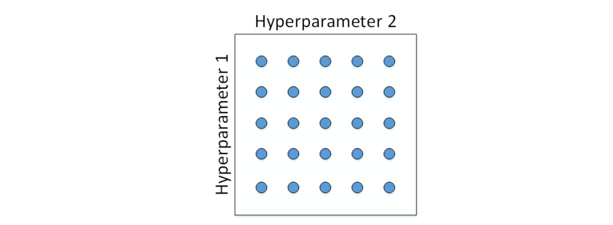
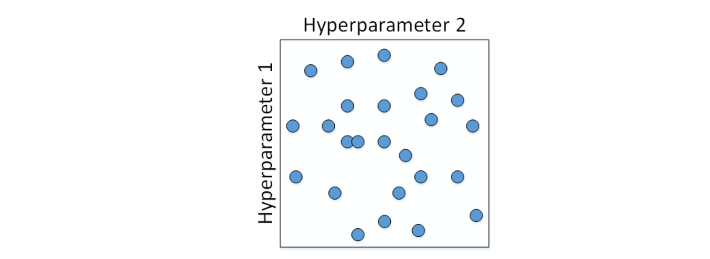
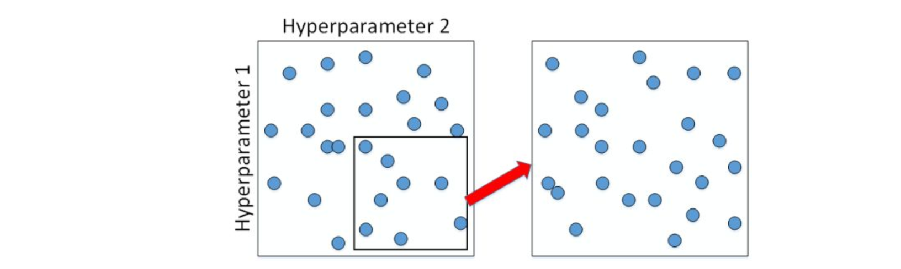
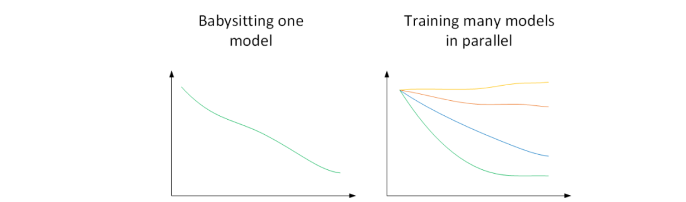
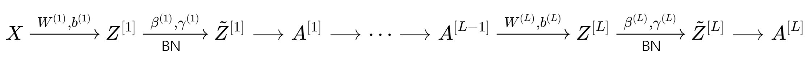

# 1 超参数调试
## 超参数
深度神经网络需要调试的超参数（Hyperparameters）较多，包括：
- $\alpha$ : 学习率因子 
- $\beta$ : 动量梯度下降因子
- $\beta_1,\beta_2,\varepsilon:$ Adam算法参数
- \#ayers : 神经网络层数
- \#hidden units：各隐藏层神经元个数
- learning rate decay:学习因子下降参数
- mini-batch size:批量训练样本包含的样本个数

通常来说，学习因子α是最重要的超参数，也是需要重点调试的超参数。

动量梯度下降因子β、各隐藏层神经元个数#hidden units和mini-batch size的重要性仅次于α。

然后就是神经网络层数#layers和学习因子下降参数learning rate decay。

Adam算法的三个参数$β_1$ , $β_2$,ε一般常设置为0.9，0.999和$10^{−8}$，不需要反复调试。

## 超参数调试方法
如何选择和调试超参数？

- **随机采样**
>传统的方法是均匀间隔地选择参数取值点，然后根据验证集的表现选择最佳参数。然而，在深度神经网络中，使用随机选择更好。随机采样的好处是可以得到更多不同的参数组合。对于每个参数，我们随机选择一些取值点，从而增加了选择最优参数的可能性。

传统机器学习中，我们对每个参数等距离选取任意个数的点，然后，分别使用不同点对应的参数组合进行训练，最后根据验证集上的表现好坏，来选定最佳的参数。

例如有两个待调试的参数，分别在每个参数上选取5个点，这样构成了5x5=25中参数组合，如下图所示：

这种做法在参数比较少的时候效果较好。但是在深度神经网络模型中，我们一般不采用这种均匀间隔取点的方法，比较好的做法是使用随机采样。

也就是说，对于上面这个例子，我们随机选择25个点，作为待调试的超参数，如下图所示：

随机化选择参数的目的是为了尽可能地得到更多种参数组合。还是上面的例子，如果使用均匀采样的话，每个参数只有5种情况；而使用随机采样的话，每个参数有25种可能的情况，因此更有可能得到最佳的参数组合。

这种做法带来的另外一个好处就是对重要性不同的参数之间的选择效果更好。假设hyperparameter1为α，hyperparameter2为ε，显然二者的重要性是不一样的。

如果使用第一种均匀采样的方法，ε的影响很小，相当于只选择了5个α值。而如果使用第二种随机采样的方法，ε和α都有可能选择25种不同值。这大大增加了α调试的个数，更有可能选择到最优值。

其实，在实际应用中完全不知道哪个参数更加重要的情况下，随机采样的方式能有效解决这一问题，但是均匀采样做不到这点。

- **粗调至细调**
>通过随机采样，我们可能找到了表现较好的一些参数区域。为了得到更精确的最佳参数，我们应该继续对选定区域进行由粗到细的采样，即放大表现较好的区域，并对该区域进行更密集的随机采样。

在经过随机采样之后，我们可能得到**某些区域**模型的表现较好。

为了得到更精确的最佳参数，我们应该继续对选定的区域进行由粗到细的采样（coarse to fine sampling scheme）。也就是放大表现较好的区域，再对此区域做更密集的随机采样。

- **重要参数的非均匀采样**
>对于重要性不同的参数，需要使用非均匀采样。例如，对于学习率因子α，使用非均匀采样可以获得更多在重要区间的取值点。通常，将线性区间转化为对数区间，然后在对数区间进行均匀采样，最后将对数值转换回线性值。

上一部分讲的调试参数使用随机采样，对于某些超参数是可以进行尺度均匀采样的，但是某些超参数需要选择不同的合适尺度进行随机采样。

例如对于超参数#layers和#hidden units，都是正整数，是可以进行均匀随机采样的，即超参数每次变化的尺度都是一致的（如每次变化为1，犹如一个刻度尺一样，刻度是均匀的）。

但是，对于某些超参数，可能需要非均匀随机采样（即非均匀刻度尺）。例如超参数α，待调范围是\[0.0001, 1\]。如果使用均匀随机采样，那么有90%的采样点分布在\[0.1, 1\]之间，只有10%分布在\[0.0001, 0.1\]之间。

这在实际应用中是不太好的，因为最佳的α值可能主要分布在\[0.0001, 0.1\]之间，而\[0.1, 1\]范围内α值效果并不好。因此我们更关注的是区间\[0.0001, 0.1\]，应该在这个区间内细分更多刻度。

通常的做法是将线性区转换为对数区间，将均匀尺度转化为非均匀尺度，然后再在对数区间下进行均匀采样。这样，\[0.0001, 0.001\]，\[0.001, 0.01\]，\[0.01, 0.1\]，\[0.1, 1\]各个区间内随机采样的超参数个数基本一致，也就扩大了之前、\[0.0001, 0.1\]区间内采样值个数。

一般解法是，如果线性区间为\[a, b\]，令m=log(a)，n=log(b)，则对应的log区间为\[m,n\]。

对log区间的\[m,n\]进行随机均匀采样，然后得到的采样值r，最后反推到线性区间，即$10^r$。

$10^r$就是最终采样的超参数。

除了α之外，动量梯度因子β也是一样，在超参数调试的时候也需要进行非均匀采样。

一般β的取值范围在\[0.9, 0.999\]之间，那么1−β的取值范围就在\[0.001, 0.1\]之间。那么直接对1−β在\[0.001, 0.1\]区间内进行log变换即可。

这里解释下为什么β也需要向α那样做非均匀采样。假设β从0.9000变化为0.9005，那么1/(1−β)基本没有变化。但假设β从0.9990变化为0.9995，那么1/(1−β)前后差别1000。β越接近1，指数加权平均的个数越多，变化越大。所以对β接近1的区间，应该采集得更密集一些。

经过调试选择完最佳的超参数并不是一成不变的，一段时间之后（例如一个月），需要根据新的数据和实际情况，再次调试超参数，以获得实时的最佳模型。

## 超参数调试方法

当计算资源有限，只能训练一个模型时，可以在该模型上调试不同的超参数，以获得最佳表现。我们称之为Babysitting one model。

当计算资源充足，可以同时训练多个模型时，可以在每个模型上调试不同的超参数，并选择表现最佳的模型。我们称之为Training many models in parallel。

# 2 批标准化（Batch Normalization）

Batch Normalization不仅可以让调试超参数更加简单，而且可以让神经网络模型更加“健壮”。也就是说较好模型可接受的超参数范围更大一些，包容性更强，使得更容易去训练一个深度神经网络。

Batch Normalization通过对隐藏层的输入进行标准化处理，使得神经网络更容易训练，提高训练速度和准确度。

## ## Batch Normalization的原理

在神经网络中，第$l$层隐藏层的输入就是第$l-1$层隐藏层的输出$A^{[l-1]}$。对$A^{[l-1]}$进行标准化处理，从原理上来说可以提高$W^{[l]}$和$b^{[l]}$的训练速度和准确度。实际应用中，一般是对$Z^{[l-1]}$进行标准化处理而不是$A^{[l-1]}$ 。

具体而言，对第$l$层隐藏层的输入$Z^{[l-1]}$做如下标准化处理： 
$$\begin{gathered}
\mu=\frac{1}{m}\sum_{i}z^{(i)} \\
\sigma^{2}=\frac{1}{m}\sum_{i}(z_{i}-\mu)^{2} \\
z_{norm}^{(i)}=\frac{z^{(i)}-\mu}{\sqrt{\sigma^2+\varepsilon}} 
\end{gathered}$$
其中，m是单个mini-batch包含样本个数，$\varepsilon$是为了防止分母为零，可取值$10^{-8}$。这样，使得该隐藏层的所有输入$z^{(i)}$均值为0，方差为1。

但是，大部分情况下并不希望所有的$z^{(i)}$均值都为0,方差都为1，也不太合理。通常需要对$z^{(i)}$进行进一步处理：

$$
\tilde{z}^{(i)}=\gamma\cdot z_{norm}^{(i)}+\beta 
$$

上式中，$\gamma$和$\beta$是learnable parameters,类似于W 和b一样，可以通过梯度下降等算法求得。这里 , $\gamma$和$\beta$的作用是让$\tilde{z}^{(i)}$的均值和方差为任意值，只需调整其值就可以了。例如，令：

$$\gamma=\sqrt{\sigma^2+\varepsilon},\quad\beta=u$$

则$\widetilde{z}^{(i)}=z^{(i)}$ ,即identity function。可见，设置$\gamma$和$\beta$为不同的值，可以得到任意的均值和方差。

这样，通过Batch Normalization,对隐藏层的各个$z^{[l](i)}$进行标准化处理，得到$\tilde{z}^{[l](i)}$,替代$z^{[l](i)}$。

值得注意的是，输入的标准化处理Normalizing inputs和隐藏层的标准化处理Batch Normalization 是有区别的。Normalizing inputs使所有输入的均值为0，方差为1。而Batch Normalization可使各隐藏层输入的均值和方差为任意值。实际上，从激活函数的角度来说，如果各隐藏层的输入均值在靠近0的区域即处于激活函数的线性区域，这样不利于训练好的非线性神经网络，得到的模型效果也不会太好。这也解释了为什么需要用$\gamma$和$\beta$来对$z^{[l](i)}$作进一步处理。

## 在神经网络中应用Batch Normalization
在神经网络中应用Batch Normalization时，我们需要对每一层的隐藏层进行标准化处理。整个流程如下图所示：

实际上，Batch Norm经常使用在mini-batch上，这也是其名称的由来。

值得注意的是，因为Batch Norm对各隐藏层$Z^{[l]}=W^{[l]}A^{[l-1]}+b^{[l]}$有去均值的操作，所以这里的常数项$b^{[l]}$可以消去，其数值效果完全可以由$\tilde{Z}^{[l]}$中的$\beta$来实现。因此，我们在使用Batch Norm 的时候，可以忽略各隐藏层的常数项$b^{[l]}$。在使用梯度下降算法时，分别对$W^{[l]}$,$\beta^{[l]}$和$\gamma^{[l]}$进行迭代更新。除了传统的梯度下降算法之外，还可以使用我们之前介绍过的动量梯度下降、RMSprop或者Adam等优化算法。

我们可以把输入特征做均值为0，方差为1的规范化处理，来加快学习速度。而Batch Norm也是对隐藏层各神经元的输入做类似的规范化处理。

总的来说，Batch Norm不仅能够提高神经网络训练速度，而且能让神经网络的权重W的更新更加“稳健”，尤其在深层神经网络中更加明显。

## Batch Normalization的正则化效果
Batch Norm也起到轻微的正则化（regularization）效果。具体表现在：
- 每个mini-batch都进行均值为0，方差为1的归一化操作
- 每个mini-batch中，对各个隐藏层的$Z^{[l]}$添加了随机噪声，效果类似于Dropout
- mini-batch越小，正则化效果越明显

但是，Batch Norm的正则化效果比较微弱，正则化也不是Batch Norm的主要功能。

## 在测试过程中的使用
训练过程中，Batch Norm是对单个mini-batch进行操作的，但在测试过程中，如果是单个样本，该如何使用Batch Norm进行处理呢？

首先，回顾一下训练过程中Batch Norm的主要过程：
$$\begin{gathered}\mu=\frac{1}{m}\sum_{i}z^{(i)}\\ \sigma^2=\frac{1}{m}\sum_{i}(z^{(i)}-\mu)^2\\ z_{norm}^{(i)}=\frac{z^{(i)}-\mu}{\sqrt{\sigma^2+\varepsilon}}\\ \tilde{z}^{(i)}=\gamma\cdot z_{norm}^{(i)}+\beta\end{gathered}$$
其中，$\mu$和$\sigma^{2}$是对单个mini-batch中所有m个样本求得的。在测试过程中，如果只有一个样本，求其均值和方差是没有意义的，就需要对$\mu$和$\sigma^{2}$进行估计。

我们使用指数加权平均的方法估计单个样本的$\mu$和$\sigma^2$。并利用训练过程中得到的$γ$和$β$计算出各层的$\tilde{z}^{(i)}$。

## 总结

Batch Normalization不仅可以提高神经网络的训练速度，还可以使神经网络的权重更新更加稳健。在深层神经网络中，由于输入数据在每一层变换后可能会发生分布改变，Batch Normalization可以帮助维持输入的稳定性。此外，Batch Normalization还具有轻微的正则化效果。

# 3 Softmax回归

目前我们介绍的都是二分类问题，神经网络输出层只有一个神经元，表示预测输出y是正类的概率P(y=1|x)，y>0.5则判断为正类，y^<0.5则判断为负类。

对于多分类问题，用C表示种类个数，神经网络中输出层就有C个神经元，即$n^{[L]}=C$。其中，每个 神经元的输出依次对应属于该类的概率，即$P(y=c|x)$。为了处理多分类问题，我们一般使用Softmax回归模型。
/1神经网络.md#Softmax回归)

Softmax回归模型输出层的激活函数如下所示：

$$
\begin{gathered}z^{[L]}=W^{[L]}a^{[L-1]}+b^{[L]}\\a_i^{[L]}=\frac{e^{z_i^{[L]}}}{\sum_{i=1}^Ce^{z_i^{[L]}}}\end{gathered}
$$

输出层每个神经元的输出$a_i^{[L]}$对应属于该类的概率，满足：
$$\sum_{i=1}^Ca_i^{[L]}=1$$
所有的$a_i^{[L]}$,即$\hat{y}$ ,维度为(C,1)。 

softmax的损失函数为：
/1神经网络.md#Softmax回归的损失函数)
