# 1 序列模型

序列模型能够应用在许多领域，例如：

- 语音识别
- 音乐发生器
- 情感分类
- DNA序列分析
- 机器翻译
- 视频动作识别
- 名称实体识别

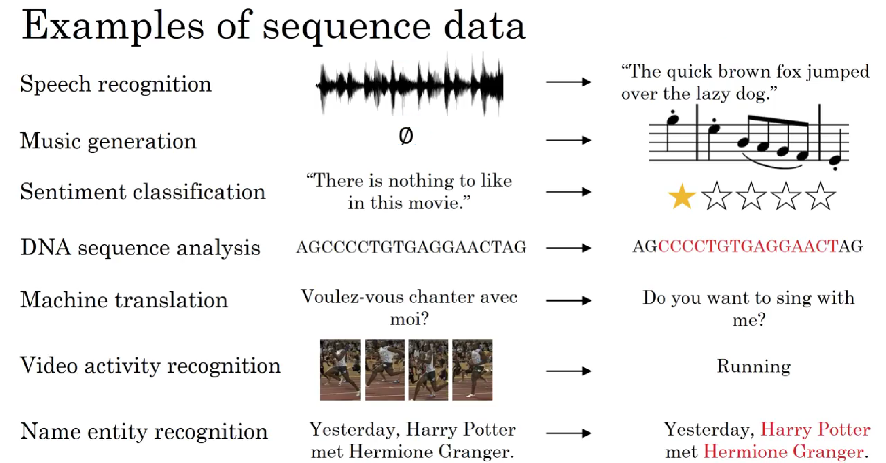

这些序列模型基本都属于监督式学习，但输入x和输出y不一定都是序列模型。

如果都是序列模型的话，模型输入长度，输出长度也不一定完全一致。

# 2 名称实体识别

下面以名称实体识别为例，介绍序列模型的命名规则，示例语句为：

- Harry Potter and Hermione Granger invented a new spell.
    

该句话包含9个单词，输出y即为1 x 9向量，每位表征对应单词是否为人名的一部分，1表示是，0表示否。

很明显，该句话中“Harry”， “Potter”， “Hermione”， “Granger”均是人名成分，所以，对应的输出y可表示为：

$$y=\begin{bmatrix}1&1&0&1&1&0&0&0&0\end{bmatrix}$$

一般约定使用$y^{<t>}$表示序列对应位置的输出，使用$T_y$表示输出序列长度，则$1\leq t\leq T_y$。

对于输入x，表示为：
$$\begin{bmatrix}x^{<1>}&x^{<2>}&x^{<3>}&x^{<4>}&x^{<5>}&x^{<6>}&x^{<7>}&x^{<8>}&x^{<9>}\end{bmatrix}$$

同样，$x^{<t>}$表示序列对应位置的输入，$T_x$表示输入序列长度。注意，此例中，$T_x=T_y$,但是也存在$T_x\neq T_y$的情况。

如何来表示每个$x^{<t>}$呢？方法是首先建立一个词汇库vocabulary，尽可能包含更多的词汇。例如一个包含10000个词汇的词汇库为：

该词汇库可看成是 10000 x 1 的向量。

然后，使用one-hot编码，例句中的每个单词$x^{<t>}$都可以表示成10000 x 1的向量，词汇表中与$x^{<t>}$对应的位置为1，其它位置为0。该$x^{<t>}$为one-hot向量。如果出现词汇表之外的单词，可以使用UNK或其他字符串来表示。

 对于多样本，以上序列模型对应的命名规则可表示为：$X^{(i)<t>}$，$y^{(i)<t>}$，$T_x^{(i)}$，$T_y^{(i)}$。其中，$i$表示第i个样本。不同样本的$T_x^{(i)}$或$T_y^{(i)}$都有可能不同。

# 3 循环神经网络

标准的神经网络不适合解决序列模型问题，而循环神经网络（RNN）是专门用来解决序列模型问题的。

RNN模型结构如下：

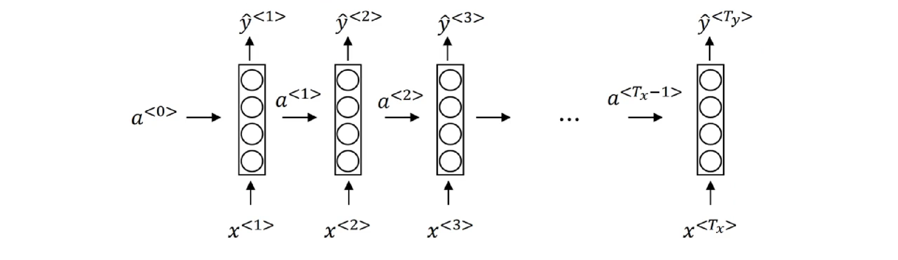

序列模型从左到右，依次传递，此例中，$T_x=T_y$。$x^{<t>}$到$\hat{y}^{<t>}$之间是隐藏神经元。$a^{<t>}$会传入到第$t+1$个元素中，作为输入。其中，$a^{<0>}$一般为零向量。

RNN模型包含三类权重系数，分别是$Wax$，$Waa$，$Wya$。且不同元素之间同一位置共享同一权重系数。
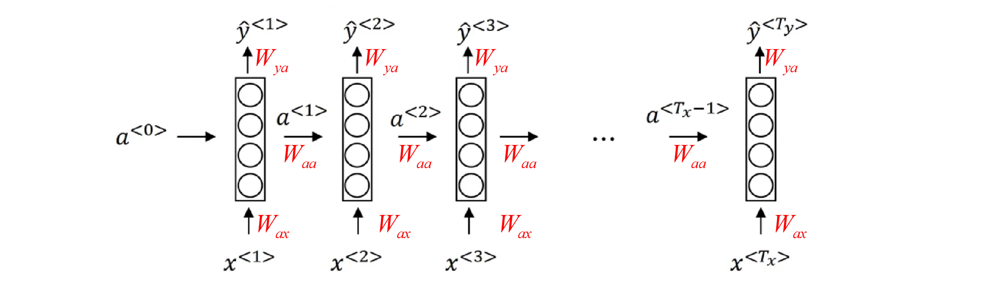

RNN的正向传播（Forward Propagation）过程为：

$$\begin{gathered}a^{<t>}=g(W_{aa}\cdot a^{<t-1>}+W_{ax}\cdot x^{<t>}+ba)\\\hat{y}^{<t>}=g(W_{ya}\cdot a^{<t>}+b_y)\end{gathered}$$

其中，g(⋅)表示激活函数，不同的问题需要使用不同的激活函数。

为了简化表达式，可以对上式进行整合：

$$\left.W_{aa}\cdot a^{<t-1>}+W_{ax}\cdot x^{<t>}=[W_{aa}W_{ax}]\left[\begin{array}{c}a^{<t-1>}\\x^{<t>}\end{array}\right.\right]\to W_a[a^{<t-1>},x^{<t>}]$$

则正向传播可表示为：
$$\begin{gathered}a^{<t>}=g(W_a[a^{<t-1>},x^{<t>}]+b_a)\\\hat{y}^{<t>}=g(W_y\cdot a^{<t>}+b_y)\end{gathered}$$

 针对上面识别人名的例子，经过RNN正向传播，单个元素的Loss function为：

$$L^{<t>}(\hat{y}^{<t>},y^{<t>})=-y^{<t>}log\hat{y}^{<t>}-(1-y^{<t>})log(1-\hat{y}^{<t>})$$

该样本所有元素的Loss function为：

$$L(\hat{y},y)=\sum_{t=1}^{T_y}L^{<t>}(\hat{y}^{<t>},y^{<t>})$$

然后，反向传播（Backpropagation）过程就是从右到左分别计算L(y^,y)对参数Wa，Wy，ba，by的偏导数。思路与做法与标准的神经网络是一样的。一般可以通过成熟的深度学习框架自动求导，例如PyTorch、Tensorflow等。

这种从右到左的求导过程被称为Backpropagation through time。

# 4 不同种类RNN

以上介绍的例子中，Tx=Ty。但是在很多RNN模型中，Tx是不等于Ty的。

根据Tx与Ty的关系，RNN模型包含以下几个类型：

- One to one: Tx=1,Ty=1Tx=1,Ty=1
- One to many: Tx=1,Ty>1Tx=1,Ty>1
- Many to one: Tx>1,Ty=1Tx>1,Ty=1
- Many to many: Tx=TyTx=Ty  
- Many to many: Tx≠TyTx≠Ty

不同类型相应的示例结构如下：
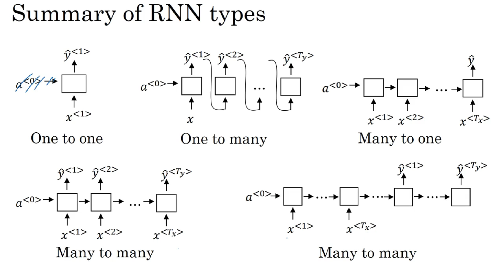

Many to many: Tx≠TyTx≠Ty 有文本翻译等。

# 5 语言模型和序列生成

语言模型是自然语言处理（NLP）中最基本和最重要的任务之一。

使用RNN能够很好地建立需要的不同语言风格的语言模型。

什么是语言模型呢？举个例子，在语音识别中，某句语音有两种翻译：

- The apple and pair salad.
    
- The apple and pear salad.

很明显，第二句话更有可能是正确的翻译。

语言模型实际上会计算出这两句话各自的出现概率。比如第一句话概率为$10^{−13}$，第二句话概率为$10^{−10}$。

也就是说，利用语言模型得到各自语句的概率，选择概率最大的语句作为正确的翻译。

概率计算的表达式为：
$$P(y^{<1>},y^{<2>},\cdots,y^{<Ty>})$$
如何使用RNN构建语言模型？

首先，我们需要一个足够大的训练集，训练集由大量的单词语句语料库（corpus）构成。

然后，对corpus的每句话进行切分词（tokenize）。做法就跟第2节介绍的一样，建立vocabulary，对每个单词进行one-hot编码。

例如下面这句话：

- The Egyptian Mau is a bread of cat.
    

One-hot编码已经介绍过了，不再赘述。

还需注意的是，每句话结束末尾，需要加上< EOS >作为语句结束符。

另外，若语句中有词汇表中没有的单词，用< UNK >表示。假设单词“Mau”不在词汇表中，则上面这句话可表示为：

- The Egyptian < UNK > is a bread of cat. < EOS >
    

准备好训练集并对语料库进行切分词等处理之后，接下来构建相应的RNN模型。
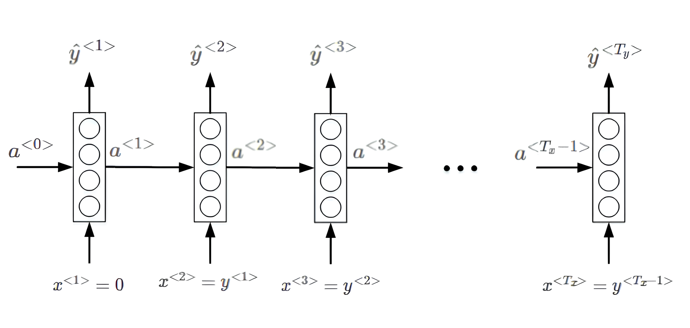

语言模型的RNN结构如上图所示，$x^{<1>}$和$a^{<0>}$均为零向量。Softmax输出层$\hat{y}^{<1>}$表示出现该语句第一个单词的概率，softmax输出层$\hat{y}^{<2>}$表示在第一个单词基础上出现第二个单词的概率，即条件概率，以此类推，最后是出现< EOS >的条件概率。

单个元素的softmax loss function为：
$$L^{<t>}(\hat{y}^{<t>},y^{<t>})=-\sum_iy_i^{<t>}log\hat{y}_i^{<t>}$$
该样本所有元素的Loss function为：
$$L(\hat{y},y)=\sum_tL^{<t>}(\hat{y}^{<t>},y^{<t>})$$
对语料库的每条语句进行RNN模型训练，最终得到的模型可以根据给出语句的前几个单词预测其余部分，将语句补充完整。

例如给出“Cats average 15”，RNN模型可能预测完整的语句是“Cats average 15 hours of sleep a day.”。

最后补充一点，整个语句出现的概率等于语句中所有元素出现的条件概率乘积。例如某个语句包含$y^{<1>},y^{<2>},y^{<3>}$，则整个语句出现的概率为：
$$P(y^{<1>},y^{<2>},y^{<3>})=P(y^{<1>})\cdot P(y^{<2>}|y^{<1>})\cdot P(y^{<3>}|y^{<1>},y^{<2>})$$

# 6 序列采样

利用训练好的RNN语言模型，可以进行新的序列采样，从而随机产生新的语句。

与上一节介绍的一样，相应的RNN模型如下所示：

首先，从第一个元素输出$\hat{y}^{<1>}$的softmax分布中随机选取一个word作为新语句的首单词。然后，$y^{<1>}$作为$x^{<2>}$ ,得到$\hat{y}^{<1>}$的softmax分布。从中选取概率最大的word作为$y^{<2>}$,继续将$y^{<2>}$作为$x^{<3>}$,以此类推。直到产生< EOS>结束符，则标志语句生成完毕。当然，也可以设定语句长度上限，达到长度上限即停止生成新的单词。最终，根据随机选择的首单词，RNN模型会生成一条新的语句。

值得一提的是，如果不希望新的语句中包含< UNK >标志符，可以在每次产生< UNK >时重新采样，直到生成非< UNK >标志符为止。

以上介绍的是word level RNN，即每次生成单个word，语句由多个words构成。

另外一种情况是character level RNN，即词汇表由单个英文字母或字符组成，如下所示：

$$Vocabulay=[a,b,c,\cdots,z,.,;,,0,1,\cdots,9,A,B,\cdots,Z]$$
Character level RNN与word level RNN不同的是，$y^{<t>}$由单个字符组成而不是word。训练集中的每句话都当成是由许多字符组成的。

character level RNN的优点是能有效避免遇到词汇表中不存在的单词< UNK >。 

但是，character level RNN的缺点也很突出。由于是字符表征，每句话的字符数量很大，这种大的跨度不利于寻找语句前部分和后部分之间的依赖性。另外，character level RNN的在训练时的计算量也是庞大的。 

基于这些缺点，目前character level RNN的应用并不广泛，但是在特定应用下仍然有发展的趋势。

# 7 RNNs 梯度消失和爆炸

语句中可能存在跨度很大的依赖关系，即某个word可能与它距离较远的某个word具有强依赖关系。例如下面这两条语句：

- The cat, which already ate fish, was full.
    
- The cats, which already ate fish, were full.
    

第一句话中，was受cat影响；第二句话中，were受cats影响。它们之间都跨越了很多单词。

而一般的RNN模型每个元素受其周围附近的影响较大，难以建立跨度较大的依赖性。

上面两句话的这种依赖关系，由于跨度很大，普通的RNN网络容易出现梯度消失，捕捉不到它们之间的依赖，造成语法错误。

另一方面，RNN也可能出现梯度爆炸的问题，即gradient过大。

常用的解决办法是设定一个阈值，一旦梯度最大值达到这个阈值，就对整个梯度向量进行尺度缩小。这种做法被称为gradient clipping。

# 8 GRU
RNN的隐藏层单元结构如下图所示：

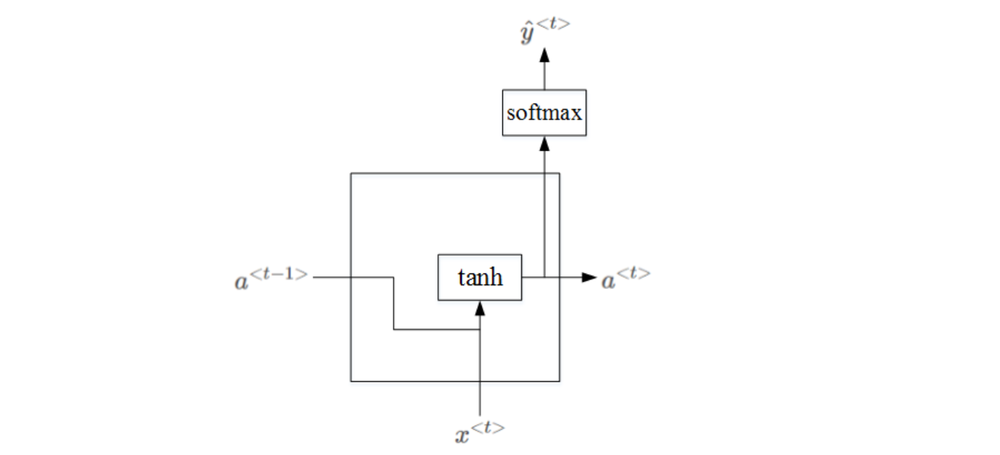

$a^{<t>}$ 的表达式为:
$$a^{<t>}=tanh(W_a[a^{<t-1>},x^{<t>}]+b_a)$$

为了解决梯度消失问题，对上述单元进行修改，添加了记忆单元，构建GRU，如下图所示：
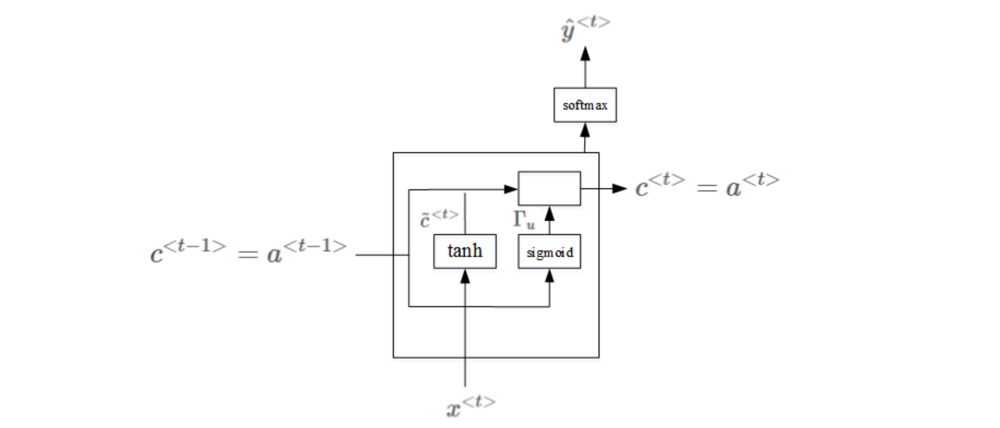
相应的表达式为：

$$\begin{aligned}\tilde{c}^{<t>} & =tanh(W_{c}[c^{<t-1>},x^{<t>}]+b_{c})\\ \Gamma_{u} & =\sigma(W_{u}[c^{<t-1>},x^{<t>}]+b_{u})\\  & \\ c^{<t>} & =\Gamma*\tilde{c}^{<t>}+(1-\Gamma_{u})*c^{<t-1>}\end{aligned}$$

其中，$c^{<t-1>}=a^{<t-1>}$，$c^{<t>}=a^{<t>}$。$\Gamma_u$意为gate，记忆单元。当$\Gamma_u=1$时，代表更新；当 $\Gamma_u=0$时，代表记忆，保留之前的模块输出。这一点跟CNN中的ResNets的作用有点类似。因此，$\Gamma_u$能够保证RNN模型中跨度很大的依赖关系不受影响，消除梯度消失问题。

上面介绍的是简化的GRU模型，完整的GRU添加了另外一个gate，即Γr，表达式如下：

注意，以上表达式中的∗表示元素相乘，而非矩阵相乘。

# 9 LSTM

LSTM是另一种更强大的解决梯度消失问题的方法。它对应的RNN隐藏层单元结构如下图所示：
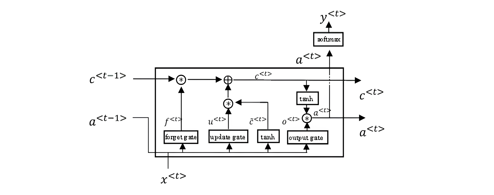
相应的表达式为：

LSTM包含三个门：Γu，Γf，Γo，分别对应更新门（update gate），遗忘门（forget gate）和输出门（output gate）。

如果考虑$c^{<t−1>}$对Γu，Γf，Γo的影响，可加入peephole connection，对LSTM的表达式进行修改：

GRU可以看成是简化的LSTM，两种方法都具有各自的优势。

# 10 Bidirectional RNN

我们在前面简单提过Bidirectional RNN，它的结构如下图所示：
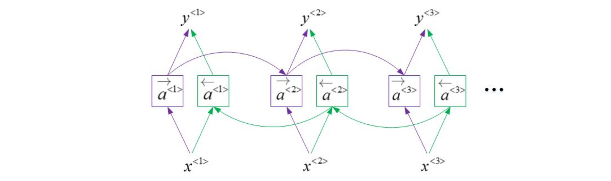
BRNN对应的输出表达式为：

BRNN能够同时对序列进行双向处理，性能大大提高。

但是计算量较大，且在处理实时语音时，需要等到完整的一句话结束时才能进行分析。

# 11 Deep RNNs

Deep RNNs由多层RNN组成，其结构如下图所示。
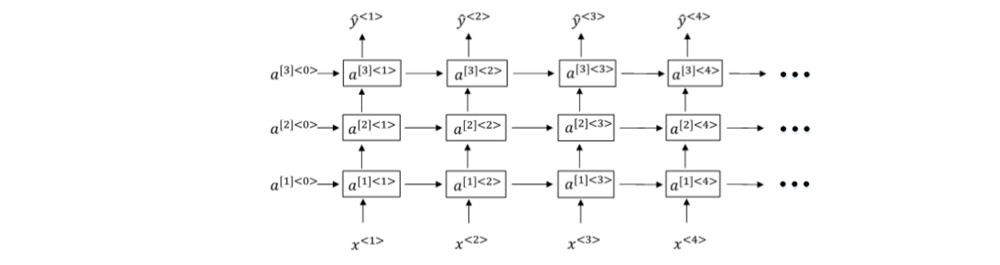

与RNN一样，用上标$[l]$表示层数，Deep RNNs中
$a^{[l]<t>}$ 的表达式为：

$a^{[l]<t>}=g(W_a^{[l]}[a^{[l]<t-1>},a^{[l-1]<t>}]+b_a^{[l]})$
我们知道DNN层数可达100多，而Deep RNNs一般没有那么多层，3层RNNs已经较复杂了。

另外一种Deep RNNs结构是每个输出层上还有一些垂直单元，如下图所示。
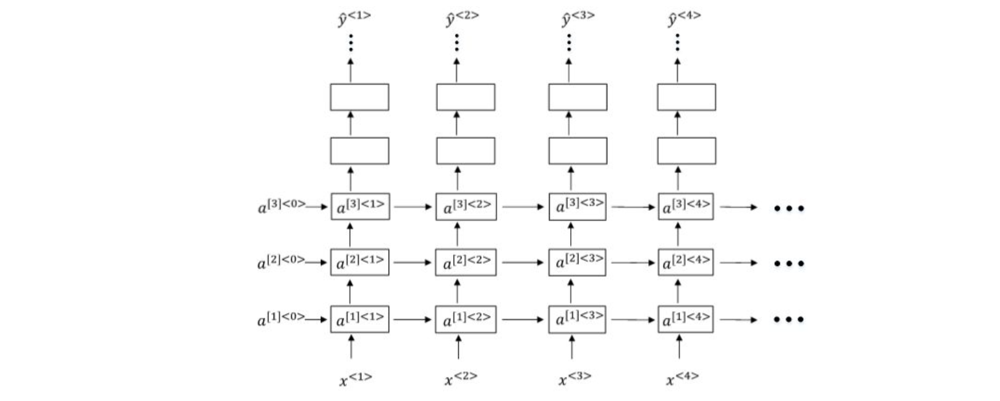